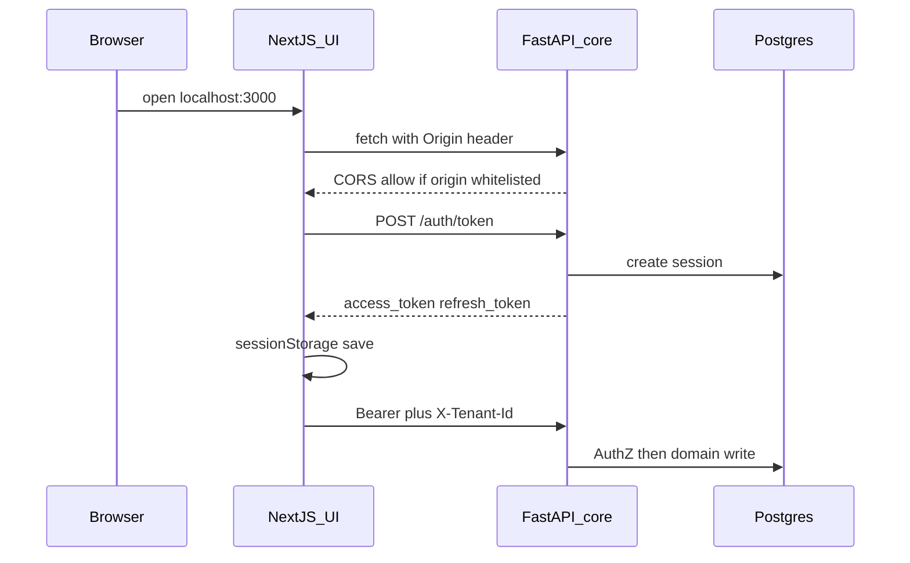

# Core API, UI integration, and CORS guide

Walkthrough of every HTTP API built in **adaan-pradaan-core**, what each stores in Postgres, which calls the **adan-pradan-ui** makes, and how CORS lets the browser talk to the API.

Live OpenAPI: [http://127.0.0.1:8000/docs](http://127.0.0.1:8000/docs)

---

## 1. Big picture

| Piece | Default local URL |
|-------|-------------------|
| UI (Next.js) | `http://127.0.0.1:3000` |
| API (FastAPI) | `http://127.0.0.1:8000` |

**Auth model:** lean **Bearer JWT** in the `Authorization` header (no cookies). Tenant-scoped product APIs also send `X-Tenant-Id`. Roles are **not** in the token — AuthZ is checked live against the DB on each request.

**Routers** mounted in [`src/api/main.py`](../src/api/main.py): identity (`/auth/*`), resources, authz, tenant, service-accounts, vendor (all under `/api/v1` except `/auth`).



---

## 2. End-to-end sequence (call order)

Follow this order for a full happy path. Each step lists **request**, **response**, **database**, and **UI**.

| Step | Journey | Endpoint | UI page |
|------|---------|----------|---------|
| 1 | J01 Register | `POST /auth/register` | `/signup` |
| 2 | J02 Verify | `POST /auth/verify-email` | `/signup/verify` |
| 3 | J03 Login | `POST /auth/token` | `/login` |
| 4 | Profile | `GET /auth/me` | AuthProvider after login |
| 5 | J04 Refresh | `POST /auth/token/refresh` | AuthProvider (auto) |
| 6 | J05 Reset | password reset-request + reset | `/forgot-password`, `/reset-password` |
| 7 | J06 Logout | `DELETE /auth/session` | Header sign-out |
| 8 | Resources | `GET/POST .../resources` | `/app` |
| 9 | J10–J11 Roles | list / grant / revoke bindings | `/app/members` |
| 10 | J07 Org upgrade | `POST/GET .../organizations/register` | `/app/org` |
| 11 | J08–J09 SA/keys | service-accounts + rotate/revoke | `/app/service-accounts` |
| 12 | J14 Tenant invite | `POST/DELETE .../members` | `/app/members` |
| 13 | J19 Org invite | org members invite / accept | `/app/vendor` |
| 14 | J20–J22 Vendor | eligibility, register, verification, decision | `/app/vendor` (admin decision API-only) |

---

### Step 1 — J01 Register

`POST /auth/register` · **Public** · **201**

**Request**
```json
{
  "email": "alice@example.com",
  "password": "SecurePass123!",
  "display_name": "Alice",
  "agreed_to_terms": true
}
```

**Response**
```json
{
  "user_id": "…",
  "org_id": "…",
  "tenant_id": "…",
  "status": "pending_verification",
  "verification_email_sent": true,
  "dev_otp": "123456"
}
```
`dev_otp` appears only when `TENANT_APP_ENV` is `dev`/`test` (no real mailer).

**Database (writes)**
- `identity.principals`, `users`, `credentials`, `verification_tokens`, `delivery_secrets`, `audit_log`
- Bootstrap: `tenant.organizations` (`org_type=individual`), `org_memberships`, `tenants`, `tenant_memberships`, `projects`
- AuthZ seed: `authz.roles`, `role_permissions`, `principal_roles` (caller → `tenant-admin`)
- `platform.outbox_events` (verification email)
- Fake Keycloak: create user in platform realm

**UI:** `/signup` → `authApi.register` → stores `pending_signup` in `sessionStorage` (no tokens yet).

---

### Step 2 — J02 Verify email

`POST /auth/verify-email` · **Public**

**Request**
```json
{ "email": "alice@example.com", "otp_code": "123456" }
```

**Response**
```json
{ "user_id": "…", "status": "active", "message": "…" }
```

**Database**
- Read/update `users`, `principals` (activate), consume `verification_tokens`, `audit_log`

**UI:** `/signup/verify` → `authApi.verifyEmail` → clears `pending_signup` → navigate to login.

---

### Step 3 — J03 Login

`POST /auth/token` · **Public**

**Request**
```json
{ "email": "alice@example.com", "password": "SecurePass123!" }
```

**Response**
```json
{
  "access_token": "…",
  "refresh_token": "…",
  "token_type": "Bearer",
  "expires_in": 900,
  "session_id": "…",
  "user_id": "…",
  "principal_id": "…"
}
```

**Database**
- Read `users`, `principals`, `identity_realms`, `credentials`
- Write `sessions` (hashed refresh), `audit_log`
- Fake Keycloak authenticate

**UI:** `/login` → `authApi.login` → `saveSession(token)`.

---

### Step 4 — Session profile (`/auth/me`)

`GET /auth/me` · **Bearer JWT**

**Response (shape)**
```json
{
  "user_id": "…",
  "principal_id": "…",
  "email": "alice@example.com",
  "display_name": "Alice",
  "status": "active",
  "organizations": [
    {
      "org_id": "…",
      "name": "…",
      "org_type": "individual",
      "participation": "consumer",
      "keycloak_realm_ref": null,
      "membership_role": "owner",
      "status": "active"
    }
  ],
  "tenants": [
    {
      "tenant_id": "…",
      "org_id": "…",
      "name": "default",
      "slug": "…",
      "status": "active",
      "membership_status": "active"
    }
  ]
}
```

**Database (read-only):** `org_memberships` + `organizations`, `tenant_memberships` + `tenants`.

**UI:** AuthProvider `refreshProfile` after login and on bootstrap → `saveProfile` → sets `session.tenant_id` from first active tenant.

---

### Step 5 — J04 Token refresh

`POST /auth/token/refresh` · **Public** (body carries secrets)

**Request**
```json
{ "refresh_token": "…", "session_id": "…" }
```

**Response**
```json
{
  "access_token": "…",
  "refresh_token": "…",
  "expires_in": 900,
  "session_id": "…"
}
```

**Database:** rotate refresh hash on `sessions`; re-issue access JWT.

**UI:** `ensureAccessToken` refreshes when access token has ≤ 60s left (`REFRESH_SKEW_MS`), or on `apiAuthed` 401 retry.

---

### Step 6 — J05 Password reset

`POST /auth/password/reset-request` · **Public**

**Request:** `{ "email": "alice@example.com" }`  
**Response:** `{ "message": "…", "dev_reset_token": "…" }` (dev token only in dev/test)

**DB:** if user exists → `password_reset_tokens`, `delivery_secrets`, `outbox_events`. Always same message (no email enumeration).

`POST /auth/password/reset` · **Public**

**Request:** `{ "reset_token": "…", "new_password": "…" }`  
**Response:** `{ "message": "…", "sessions_revoked": N }`

**DB:** consume reset token; Keycloak `set_password`; revoke `sessions`; `audit_log`.

**UI:** `/forgot-password`, `/reset-password`.

---

### Step 7 — J06 Logout / session revoke

| Method | Path | Auth | Notes |
|--------|------|------|-------|
| `DELETE` | `/auth/session` | Bearer | Logout current session |
| `DELETE` | `/auth/sessions` | Bearer | Revoke other sessions |
| `DELETE` | `/auth/sessions/{session_id}` | Bearer + `X-Tenant-Id` + `tenant.admin` | Admin revoke one |
| `POST` | `/auth/users/{user_id}/revoke-access` | Bearer + `X-Tenant-Id` + `tenant.admin` | Lock principal + sessions |

**DB:** update `sessions` (and for revoke-access: `principals`/`users` locked, `audit_log`).

**UI wired:** Header sign-out → `DELETE /auth/session` only. Admin revoke endpoints are API-only.

---

### Step 8 — Resources (AuthZ proof)

`GET /api/v1/tenants/{tenant_id}/resources` · Bearer + **`resource.read`**  
`POST /api/v1/tenants/{tenant_id}/resources` · Bearer + **`resource.create`** · **201**

**Create request**
```json
{ "name": "workspace-1", "resource_type": "workspace", "external_ref": null }
```

**Response item**
```json
{
  "id": "…",
  "tenant_id": "…",
  "name": "workspace-1",
  "resource_type": "workspace",
  "status": "active"
}
```

**DB:** AuthZ read (`principal_roles` → permissions); create writes `resource.resources`.

**UI:** `/app` → `resourcesApi.list` / `create` with **Bearer + `X-Tenant-Id`**.

---

### Step 9 — J10–J11 Role bindings (+ list helpers)

| Method | Path | AuthZ |
|--------|------|-------|
| `GET` | `/api/v1/tenants/{tenant_id}/roles` | `tenant.member.read` |
| `GET` | `/api/v1/tenants/{tenant_id}/members` | `tenant.member.read` |
| `POST` | `/api/v1/tenants/{tenant_id}/roles/{role_id}/bindings` | `tenant.admin` · **201** |
| `DELETE` | `.../bindings/{binding_id}` | `tenant.admin` |

**Grant request**
```json
{ "user_id": "…", "justification": "needs resource-admin" }
```
(or `principal_id` instead of `user_id`)

**Grant response**
```json
{
  "binding_id": "…",
  "principal_id": "…",
  "user_id": "…",
  "role_id": "…",
  "role": "resource-admin",
  "status": "active",
  "granted_by": "…",
  "granted_at": "…",
  "expires_at": null
}
```

**DB:** write `authz.principal_roles` (+ soft revoke sets `status=revoked`); `identity.audit_log`. Cannot revoke last `tenant-admin` (409).

**UI:** `/app/members` → `membersApi.*` with Bearer + `X-Tenant-Id`.

---

### Step 10 — J07 Organization upgrade

`POST /api/v1/organizations/register` · Bearer · must own **individual** org · **202**

**Request**
```json
{
  "name": "Acme Corp",
  "slug": "acme-corp",
  "contact_name": "Alice",
  "contact_email": "alice@acme.com",
  "country": "IN"
}
```

**Response**
```json
{
  "request_id": "…",
  "status": "completed",
  "org_id": "…",
  "estimated_ms": 0,
  "keycloak_realm_ref": "acme-corp",
  "realm_url": "acme-corp.auth.platform.io",
  "error_message": null
}
```
(Local fake Keycloak completes synchronously; status is usually `completed` immediately.)

`GET /api/v1/organizations/register/{request_id}` · Bearer (requester only) — same response shape.

**Database (on success)**
- `tenant.organization_registration_requests`
- `identity.identity_realms` (`realm_type=organization`)
- Update `tenant.organizations` → `org_type=organization`, `slug`, `keycloak_realm_ref`
- New `tenants` (`{slug}-default`), `tenant_memberships`, `projects`
- Seed AuthZ roles + grant `tenant-admin` on new tenant
- `audit_log` (`organization.registered`, `keycloak.realm.created`)
- Fake Keycloak `create_realm`

**UI:** `/app/org` → `orgApi.register` → poll `getRegistration` until completed/failed → `refreshProfile` → may `setSessionTenantId` to `{slug}-default`.

---

### Step 11 — J08–J09 Service accounts & API keys

All under `/api/v1/tenants/{tenant_id}/service-accounts…` · Bearer + **`tenant.admin`**

| Method | Path | Purpose |
|--------|------|---------|
| `GET` | `/service-accounts` | List |
| `POST` | `/service-accounts` | Create SA + one-time API key · **201** |
| `POST` | `/{sa_id}/roles` | Assign role · **201** |
| `POST` | `/{sa_id}/api-keys/rotate` | Revoke old + issue new |
| `DELETE` | `/{sa_id}/api-keys/{key_id}` | Revoke only |

**Create request**
```json
{
  "name": "sa-deploy-prod",
  "description": "CI bot",
  "initial_role": "resource-admin"
}
```

**Create response** (raw key shown **once**)
```json
{
  "service_account_id": "…",
  "principal_id": "…",
  "name": "sa-deploy-prod",
  "api_key": "ak_….…",
  "key_prefix": "ak_…",
  "key_id": "…",
  "status": "active",
  "role_assigned": "resource-admin"
}
```

**DB:** `identity.principals` (`service_account`), `service_accounts`, `api_keys` (bcrypt hash only), optional `principal_roles`, `audit_log`. Rotate: old key `revoked`, new row `active`.

**UI:** `/app/service-accounts` → list / create / rotate (revoke-by-id not exposed in UI).

---

### Step 12 — J14 Tenant member invite / remove

`POST /api/v1/tenants/{tenant_id}/members` · Bearer + **`tenant.admin`** · **201**

**Request:** `{ "user_id": "…", "role": "viewer" }`  
**Response:** `{ "membership_id", "tenant_id", "user_id", "role", "status": "active" }`

**DB:** `tenant_memberships`, `principal_roles`, `audit_log`. Invitee must already be an org member.

`DELETE /api/v1/tenants/{tenant_id}/members/{user_id}` — soft-remove membership; revoke bindings; 409 if last tenant-admin.

**UI:** `/app/members` → tenant invite form (`tenantMembersApi.invite`) with `user_id` + role. User must already be an org member.

---

### Step 13 — J19 Org member invite

`POST /api/v1/organizations/{org_id}/members` · Bearer + **org owner** · **201**

**Request:** `{ "email": "bob@example.com", "org_role": "member" }`  
**Response:** `{ "invite_id", "email", "org_role", "status": "invited", "user_id" }`

Invitee must already have an account. Status starts as `invited`.

`POST /api/v1/organizations/{org_id}/members/accept` · Bearer (invitee) → status `active`.

`DELETE /api/v1/organizations/{org_id}/members/{user_id}` · org owner — remove + cascade revoke tenant bindings under that org.

**DB:** `org_memberships`; on remove also `tenant_memberships` / `principal_roles`; `audit_log`.

**UI:** `/app/vendor` → invite form (`orgApi.inviteMember`) + accept form (`orgApi.acceptInvite` with org UUID).

---

### Step 14 — J20–J22 Vendor

`GET /api/v1/organizations/{org_id}/vendor-eligibility` · Bearer + org owner

**Response**
```json
{
  "eligible": true,
  "reasons": [],
  "requirements": ["business_registration_doc", "bank_account", "tax_id"]
}
```
Not eligible if still `org_type=individual` or vendor profile already exists.

`POST /api/v1/organizations/{org_id}/vendor/register` · Bearer + org owner · org must be `organization` · **202**

**Request**
```json
{
  "legal_name": "Acme Corp Pvt Ltd",
  "tax_id": "27AAAAA0000A1Z5",
  "payout_bank_account": "XXXXXXXX1234",
  "contact_email": "vendor-ops@acme.com",
  "business_doc_url": "https://uploads.example.com/doc.pdf"
}
```

**Response**
```json
{
  "vendor_id": "…",
  "org_id": "…",
  "status": "pending_verification",
  "verification_id": "…"
}
```

**DB:** `vendor.profiles`, `vendor.verifications` (`queued`), update `organizations.participation` → `consumer_and_vendor`, `audit_log`.

`GET /api/v1/vendors/{vendor_id}/verification` · org owner — status read.

`POST /api/v1/admin/vendor-verifications/{verification_id}/decision` · Bearer + **platform operator** org

**Request:** `{ "decision": "approved", "notes": "…" }` (`approved` | `rejected`)

**DB:** update verification + profile status; on reject roll participation back to `consumer`.

**UI:** `/app/vendor` → eligibility + register + verification status panel (vendor_id in `sessionStorage`) + org invite/accept. Admin decision remains API-only.

---

## 3. UI integration — how it works

UI repo: **adan-pradan-ui** (sibling of this core). Base URL: `NEXT_PUBLIC_API_URL` or `http://127.0.0.1:8000`.

### Glue files

| File | Role |
|------|------|
| `app/lib/api.ts` | `api` / `apiAuthed`; clients: `authApi`, `resourcesApi`, `membersApi`, `orgApi`, `serviceAccountsApi`, `vendorApi`, `tenantMembersApi` |
| `app/lib/session.ts` | `sessionStorage` persistence |
| `app/components/auth-provider.tsx` | bootstrap, `ensureAccessToken`, `refreshProfile`, `signOut` |

### sessionStorage keys

| Key | Contents |
|-----|----------|
| `adan_pradan_session` | `access_token`, `refresh_token`, `session_id`, `user_id`, `principal_id`, `expires_at`, optional `tenant_id` |
| `adan_pradan_profile` | Last `/auth/me` payload |
| `adan_pradan_pending_signup` | Email (+ ids, optional `dev_otp`) between register and verify |

### Header rules

| Call type | `Authorization` | `X-Tenant-Id` |
|-----------|-----------------|---------------|
| Public auth (`/auth/register`, token, verify, reset) | — | — |
| Authed, no tenant (org upgrade, vendor, `/auth/me`) | `Bearer <access>` | — |
| Tenant-scoped (resources, members, SA) | `Bearer <access>` | session `tenant_id` |

`apiAuthed` on **401**: force refresh once, then retry.

### UI ↔ API matrix

| UI route | APIs called | Headers |
|----------|-------------|---------|
| `/signup` | `POST /auth/register` | none |
| `/signup/verify` | `POST /auth/verify-email` | none |
| `/login` | `POST /auth/token`, then `GET /auth/me` | me: Bearer |
| `/forgot-password` | `POST /auth/password/reset-request` | none |
| `/reset-password` | `POST /auth/password/reset` | none |
| AuthProvider (global) | refresh, me, logout | Bearer where needed |
| `/app` | list/create resources | Bearer + `X-Tenant-Id` |
| `/app/members` | roles, members, grant, revoke, **tenant invite** | Bearer + `X-Tenant-Id` |
| `/app/org` | org register + **poll** status (+ me refresh) | Bearer |
| `/app/service-accounts` | list, create, rotate | Bearer + `X-Tenant-Id` |
| `/app/vendor` | eligibility, register, **verification status**, org invite, **accept invite** | Bearer |
| Landing CTAs | none (links to `/app`, `/app/vendor`, `/login`, `/signup`) | — |

### Built in API but not wired in UI

(As of N1 wiring: org poll, vendor verification status, tenant invite, and org accept are wired in the UI.)

Still API-only / no dedicated UI:

- Admin vendor decision (`POST /api/v1/admin/vendor-verifications/{id}/decision`)
- Admin session revoke / user revoke-access
- SA role assign + key revoke-by-id (rotate is wired)

---

## 4. CORS — what, why, how

### What

**CORS** (Cross-Origin Resource Sharing) is a **browser** security rule. A page loaded from origin **A** may only call an API on origin **B** if the API responds with headers that explicitly allow A (for example `Access-Control-Allow-Origin: http://127.0.0.1:3000`).

An **origin** is scheme + host + port. So `http://127.0.0.1:3000` and `http://127.0.0.1:8000` are **different** origins.

### Why we need it

The UI runs on `:3000` and calls the API on `:8000` with `fetch`. Without CORS, the browser blocks the response even if the API returned 200. Tools like `curl` and server-to-server calls are **not** subject to CORS.

### How this project handles it

Configured in [`src/api/main.py`](../src/api/main.py) from settings [`src/shared/settings.py`](../src/shared/settings.py):

| Setting | Env var | Default |
|---------|---------|---------|
| `cors_origins` | `TENANT_CORS_ORIGINS` | `http://localhost:3000,http://127.0.0.1:3000` |

If the list is **empty**, no CORS middleware is installed (API-only / same-origin setups).

Middleware options:

| Option | Value | Meaning |
|--------|-------|---------|
| `allow_origins` | whitelist from env | Only those UI origins |
| `allow_credentials` | `False` | No cookie auth; JWT is in `Authorization` |
| `allow_methods` | `*` | GET, POST, DELETE, OPTIONS, … |
| `allow_headers` | `Authorization`, `Content-Type`, `X-Tenant-Id`, `X-Request-Id` | What the UI may send |

`docker-compose.yml` sets the same `TENANT_CORS_ORIGINS` for the API container.

### Preflight

For non-simple requests (e.g. `POST` with `Authorization` or `X-Tenant-Id`), the browser first sends **`OPTIONS`**. FastAPI’s `CORSMiddleware` answers with allow headers. If your origin is missing from the whitelist, the real POST never runs from the browser.

### CORS vs auth

CORS does **not** authenticate users. It only lets the browser expose the response to JavaScript. Auth is still Bearer JWT checked by the API.

---

## 5. Quick reference — all endpoints

| # | Method | Path | Auth / AuthZ |
|---|--------|------|--------------|
| 1 | POST | `/auth/register` | Public |
| 2 | POST | `/auth/verify-email` | Public |
| 3 | GET | `/auth/me` | Bearer |
| 4 | POST | `/auth/token` | Public |
| 5 | POST | `/auth/token/refresh` | Public (refresh body) |
| 6 | DELETE | `/auth/session` | Bearer |
| 7 | DELETE | `/auth/sessions/{session_id}` | Bearer + `X-Tenant-Id` + `tenant.admin` |
| 8 | DELETE | `/auth/sessions` | Bearer |
| 9 | POST | `/auth/users/{user_id}/revoke-access` | Bearer + `X-Tenant-Id` + `tenant.admin` |
| 10 | POST | `/auth/password/reset-request` | Public |
| 11 | POST | `/auth/password/reset` | Public |
| 12 | GET | `/api/v1/tenants/{tenant_id}/service-accounts` | Bearer + `tenant.admin` |
| 13 | POST | `/api/v1/tenants/{tenant_id}/service-accounts` | Bearer + `tenant.admin` |
| 14 | POST | `.../service-accounts/{sa_id}/roles` | Bearer + `tenant.admin` |
| 15 | POST | `.../api-keys/rotate` | Bearer + `tenant.admin` |
| 16 | DELETE | `.../api-keys/{key_id}` | Bearer + `tenant.admin` |
| 17 | GET | `/api/v1/tenants/{tenant_id}/roles` | Bearer + `tenant.member.read` |
| 18 | GET | `/api/v1/tenants/{tenant_id}/members` | Bearer + `tenant.member.read` |
| 19 | POST | `.../roles/{role_id}/bindings` | Bearer + `tenant.admin` |
| 20 | DELETE | `.../bindings/{binding_id}` | Bearer + `tenant.admin` |
| 21 | GET | `/api/v1/tenants/{tenant_id}/resources` | Bearer + `resource.read` |
| 22 | POST | `/api/v1/tenants/{tenant_id}/resources` | Bearer + `resource.create` |
| 23 | POST | `/api/v1/organizations/register` | Bearer + individual-org owner |
| 24 | GET | `/api/v1/organizations/register/{request_id}` | Bearer (requester) |
| 25 | POST | `/api/v1/tenants/{tenant_id}/members` | Bearer + `tenant.admin` |
| 26 | DELETE | `/api/v1/tenants/{tenant_id}/members/{user_id}` | Bearer + `tenant.admin` |
| 27 | POST | `/api/v1/organizations/{org_id}/members` | Bearer + org owner |
| 28 | POST | `/api/v1/organizations/{org_id}/members/accept` | Bearer (invitee) |
| 29 | DELETE | `/api/v1/organizations/{org_id}/members/{user_id}` | Bearer + org owner |
| 30 | GET | `/api/v1/organizations/{org_id}/vendor-eligibility` | Bearer + org owner |
| 31 | POST | `/api/v1/organizations/{org_id}/vendor/register` | Bearer + org owner |
| 32 | GET | `/api/v1/vendors/{vendor_id}/verification` | Bearer + org owner |
| 33 | POST | `/api/v1/admin/vendor-verifications/{verification_id}/decision` | Bearer + platform operator |

**Permissions enforced in handlers today:** `tenant.admin`, `tenant.member.read`, `resource.read`, `resource.create`.

### Not implemented as HTTP yet

| Journey | Typical path | Status |
|---------|--------------|--------|
| J12 standalone tenant create | `POST /organizations/{org_id}/tenants` | Missing (default tenant via register / J07) |
| J13 projects | `POST /tenants/{tenant_id}/projects` | Missing (default project on bootstrap) |
| J15 tenant settings | `PATCH /tenants/{tenant_id}/settings` | Missing |
| J16 onboarding checklist | `GET /tenants/{tenant_id}/onboarding` | Missing |
| J17 org overview | `GET /organizations/{org_id}/overview` | Missing |
| J18 realm status/retry | `GET/POST .../realm` | Partial via J07 poll only |
| J23–J25, J27–J34, J36, J38–J42 | plugin, catalog, install, provision, product archive | Live under `/api/v1` |
| J26, J35, J37 governance review, claim, and vendor suspend | see [02_Tenant_Vendor_Plugin_Journeys.md](User_Journeys/02_Tenant_Vendor_Plugin_Journeys.md) | Live under `/api/v1` |
| J43, J44, J48–J52 wishlist, cart, checkout, orders, returns, subscriptions, addresses | same doc | Live under `/api/v1` |
| J45–J47 vendor payouts, settings, support | same doc | Not started |

---

## 6. What each API does (logical walkthrough)

One paragraph per endpoint. Examples use **Alice** (owner), **Bob** (`bob@example.com`), org **Acme** (`acme-corp`), tenant `acme-corp-default`, and service account `sa-deploy-prod`.

### 1. POST `/auth/register`

When Alice submits email, password, display name, and terms acceptance on signup, the API creates an inactive principal and pending user, a Keycloak subject (fake in local), an individual organization with a default tenant and project, seeds system roles, binds Alice as `tenant-admin`, and stores a verification OTP; the response returns her `user_id` / `org_id` / `tenant_id` (and `dev_otp` in dev) so the UI can send her to email verify before she can log in.

### 2. POST `/auth/verify-email`

Alice enters the 6-digit OTP from her email (or the local `dev_otp`); the API checks the hashed token, marks her user and principal `active`, and clears the pending verification so she is allowed to call `/auth/token` next—without this step login is refused for a still-pending account.

### 3. GET `/auth/me`

With Alice’s access token, the API returns who she is plus every active org membership and tenant membership (org type, participation, realm ref, tenant slugs); the UI AuthProvider calls this after login and on bootstrap to fill the dashboard shell and pick a `tenant_id` for later `X-Tenant-Id` calls.

### 4. POST `/auth/token`

Alice posts email and password; after Keycloak authenticate and active-user checks, the API creates a platform session, returns a short-lived access JWT and a refresh token with `session_id` / `user_id` / `principal_id`, and the login page stores them in `sessionStorage` so subsequent product APIs can send `Authorization: Bearer …`.

### 5. POST `/auth/token/refresh`

Before Alice’s access token expires (or after a 401), the UI posts her refresh token and `session_id`; the API rotates the refresh hash on that session and issues a new token pair so she stays signed in without typing her password again.

### 6. DELETE `/auth/session`

Alice signs out; the API revokes only the session encoded in her current Bearer token so that access/refresh pair stops working, matching the header “Sign out” control in the UI.

### 7. DELETE `/auth/sessions/{session_id}`

A tenant admin (Alice) with `tenant.admin` and `X-Tenant-Id` forces logout of a specific session id belonging to someone in that tenant—for example kicking Bob’s stolen laptop session—without revoking Alice’s own session unless she targets it.

### 8. DELETE `/auth/sessions`

Alice revokes every other active session for her user except the one she is calling from, useful after a password change suspicion or “log out everywhere else” without ending her current browser tab.

### 9. POST `/auth/users/{user_id}/revoke-access`

With `tenant.admin`, Alice locks Bob’s principal and user and revokes his sessions so Bob cannot authenticate or use tokens until an operator unlocks him—stronger than session revoke alone when access must be cut off entirely.

### 10. POST `/auth/password/reset-request`

Anyone can post an email; if Alice’s account exists the API stores a reset token and outbox delivery secret (returning `dev_reset_token` in local), but always shows a generic success message so attackers cannot tell whether `alice@example.com` is registered.

### 11. POST `/auth/password/reset`

Alice submits the reset token and a new password; the API validates the token, updates Keycloak password, revokes her sessions, and confirmation lets her log in with the new password on `/login`.

### 12. GET `/api/v1/tenants/{tenant_id}/service-accounts`

Alice (tenant admin) lists robot accounts for `acme-corp-default`, including names and active key prefixes (never the raw secret), so the service-accounts UI can show what CI bots exist before creating or rotating keys.

### 13. POST `/api/v1/tenants/{tenant_id}/service-accounts`

Alice creates `sa-deploy-prod`, which inserts a `service_account` principal, one bcrypt-hashed API key, and optionally an initial role like `resource-admin`; the response includes the **full** `api_key` once so she can paste it into CI—after that only the hash remains in the database.

### 14. POST `/api/v1/tenants/{tenant_id}/service-accounts/{sa_id}/roles`

Alice assigns another role (by `role_id`) to an existing SA so the bot gains permissions such as `resource.create` without being a human member; AuthZ then evaluates that principal on every API call the same way it does for Alice.

### 15. POST `/api/v1/tenants/{tenant_id}/service-accounts/{sa_id}/api-keys/rotate`

When Alice rotates the CI key, the API atomically marks the old key revoked and issues a new raw key in one transaction so `sa-deploy-prod` never has two active keys and never has a gap with zero keys during rotation.

### 16. DELETE `/api/v1/tenants/{tenant_id}/service-accounts/{sa_id}/api-keys/{key_id}`

Alice permanently revokes a compromised key with no replacement; the SA cannot authenticate until she creates or rotates a new key, stopping leaked credentials immediately.

### 17. GET `/api/v1/tenants/{tenant_id}/roles`

Anyone with `tenant.member.read` (Alice on members page) lists active system roles for the tenant—`tenant-admin`, `resource-admin`, `viewer`—so the UI can populate grant and invite dropdowns with real `role_id` / name values.

### 18. GET `/api/v1/tenants/{tenant_id}/members`

Lists human tenant members with their active role bindings; Alice sees herself and Bob with roles like `tenant-admin` / `viewer` so she can grant or revoke without guessing principal ids.

### 19. POST `/api/v1/tenants/{tenant_id}/roles/{role_id}/bindings`

Alice grants Bob `resource-admin` by posting his `user_id` (or a principal id); a new `principal_roles` row becomes active immediately so Bob’s next API call can create resources, with an optional justification and expiry.

### 20. DELETE `/api/v1/tenants/{tenant_id}/roles/{role_id}/bindings/{binding_id}`

Alice soft-revokes that binding (`status=revoked`); Bob loses the role on the next AuthZ check, and the API refuses if this would remove the last `tenant-admin` so the tenant is never left without an admin.

### 21. GET `/api/v1/tenants/{tenant_id}/resources`

With `resource.read`, Alice (or a SA) lists resources in her tenant for the `/app` dashboard—empty until something is created—proving AuthZ gates read access per tenant path id.

### 22. POST `/api/v1/tenants/{tenant_id}/resources`

With `resource.create`, Alice creates e.g. `workspace-1` of type `workspace`; the row is stored under that tenant only, and a caller without the permission or with the wrong tenant id gets 403.

### 23. POST `/api/v1/organizations/register`

Alice, still on an individual org, submits Acme’s name/slug/contacts; the API provisions a Keycloak org realm (fake), flips the org to `organization`, creates tenant `acme-corp-default`, seeds roles, grants her `tenant-admin` there, and records the registration request—typically finishing as `completed` locally so `/app/org` can switch her session to the new tenant.

### 24. GET `/api/v1/organizations/register/{request_id}`

Alice (the requester) polls the same request to see `processing`, `completed`, or `failed` plus `keycloak_realm_ref` / `realm_url`; the org UI uses this when the POST does not already return a terminal status, matching the async journey contract.

### 25. POST `/api/v1/tenants/{tenant_id}/members`

Alice invites Bob into `acme-corp-default` with role `viewer` **only if** Bob is already an org member; the API adds tenant membership and a role binding—used from `/app/members` after Bob was invited at org level on `/app/vendor`.

### 26. DELETE `/api/v1/tenants/{tenant_id}/members/{user_id}`

Alice removes Bob from that tenant, soft-removes membership, and revokes his tenant role bindings, but cannot remove the last tenant-admin so Acme’s tenant always keeps at least one admin.

### 27. POST `/api/v1/organizations/{org_id}/members`

Alice invites `bob@example.com` as org `member`; Bob must already have an account—the API creates an `org_memberships` row with status `invited` (no tenant access yet) until Bob accepts.

### 28. POST `/api/v1/organizations/{org_id}/members/accept`

Bob, signed in, posts accept for Acme’s `org_id`; his membership becomes `active` so Alice can then add him to a tenant via J14—wired as the “Accept org invite” form on `/app/vendor`.

### 29. DELETE `/api/v1/organizations/{org_id}/members/{user_id}`

Alice removes Bob from the organization and cascades revoke of his role bindings (and tenant memberships) under Acme’s tenants so he loses all Acme access in one shot (she cannot remove herself this way).

### 30. GET `/api/v1/organizations/{org_id}/vendor-eligibility`

Alice checks whether Acme can become a vendor; the API returns `eligible: false` with a reason if she is still `individual` or already has a vendor profile, otherwise lists required docs—driving the eligibility card on `/app/vendor`.

### 31. POST `/api/v1/organizations/{org_id}/vendor/register`

Alice submits legal name, tax id, bank, contact, and doc URL; the API creates a `vendor.profiles` row (`pending_verification`), queues a verification, and sets org `participation` to `consumer_and_vendor` so she can sell plugins after KYC.

### 32. GET `/api/v1/vendors/{vendor_id}/verification`

Alice reads her vendor’s status and latest verification id/notes after register; the UI stores `vendor_id` and refreshes this panel so she is not left guessing whether ops approved her.

### 33. POST `/api/v1/admin/vendor-verifications/{verification_id}/decision`

A **platform operator** approves or rejects the queued verification; on approve the vendor becomes `verified`, on reject the profile is rejected and participation can roll back to `consumer`—still API-only (no admin UI yet), required to complete the KYC path end-to-end.

---

## Related docs

- Journey specs: [User_Journeys/Adanpradan_identity_auth_journeys.md](User_Journeys/Adanpradan_identity_auth_journeys.md), [User_Journeys/02_Tenant_Vendor_Plugin_Journeys.md](User_Journeys/02_Tenant_Vendor_Plugin_Journeys.md)
- Architecture: [architecture/system-overview2.md](architecture/system-overview2.md)
