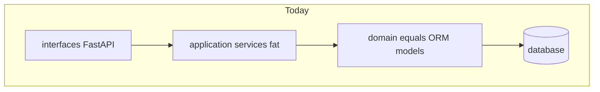
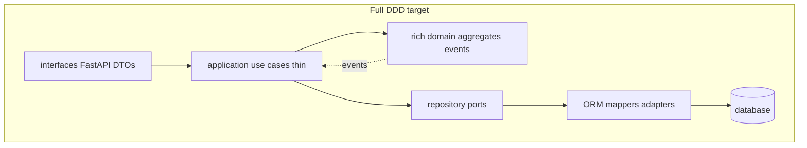

# Full DDD evolution guide

**Status:** Blueprint only — **no code changes required by this document.**  
**Audience:** Engineers deciding whether / how to evolve `src/` from DDD-inspired layering to full tactical Domain-Driven Design.

**Baseline today:** [phase2-backend-structure.md](phase2-backend-structure.md) — *“Layering conventions (DDD-inspired, minimal).”*

---

## 1. Current state

The backend is a **modular monolith** with folder-per-bounded-context and clean-ish layers. It is **not** full DDD.

| Present | Evidence |
|---------|----------|
| Bounded contexts as modules | `identity`, `tenant`, `authorization`, `resources`, `marketplace`, `billing`, `metering`, `audit` |
| Layer folders | `domain/`, `application/`, `infrastructure/` (partial), `interfaces/` |
| Anemic domain models | SQLAlchemy ORM classes in `domain/models.py` (fields only) |
| Fat application services | Rules live in `AuthService`, `PluginService`, `TenantService`, etc. |
| Direct `Session` usage | Many services query/commit via SQLAlchemy session |
| Partial repositories | e.g. `tenant/infrastructure/repos.py`; other modules skip repos |



Business language already lives in [docs/domains/](../domains/README.md). Code has not yet enforced that language as rich aggregates.

---

## 2. Target: full tactical DDD

Keep the **modular monolith** and FastAPI + SQLAlchemy. Change **where rules live** and **how persistence is isolated**.

| Concept | Meaning in this system |
|---------|------------------------|
| Bounded context | Existing modules; harden imports so contexts talk via APIs/events, not shared tables ad hoc |
| Aggregate | Consistency boundary loaded/saved as one unit (e.g. `Organization` rules; `ServicePlugin` + version lifecycle) |
| Entity | Has identity (`User.id`, `Tenant.id`) |
| Value object | Equality by value (`Email`, `PermissionCode`, `Slug`, money/amount types) |
| Domain service | Cross-entity rule that does not fit one aggregate |
| Domain event | Fact raised inside domain (`UserRegistered`, `PluginVersionApproved`) |
| Application service / use case | Thin: authz → load aggregate → call domain → save → publish events |
| Repository port | Interface in domain (or application ports); implementation in infrastructure |
| Anti-corruption layer | Keycloak, vendor plugin adapters, payment providers |



---

## 3. What changes by layer

### Domain

| Before | After |
|--------|-------|
| `domain/models.py` = SQLAlchemy `Base` tables | Pure domain model (dataclasses / plain classes) **without** ORM |
| Status as free-form `str` | Typed enums (`UserStatus`, `PluginVersionStatus`, …) |
| Invariants in services | Methods on aggregates: `submit_for_review()`, `approve()`, `bootstrap_individual()` |
| No domain events | Events collected on aggregate (e.g. `pull_events()`) |

### Application

| Before | After |
|--------|-------|
| Services own workflows + SQL + hashing | Use cases: start transaction, load aggregate via port, call domain, persist, publish |
| Cross-module method calls for side effects | Prefer domain event → handler in the owning context, or explicit ACL API |
| Password/JWT mixed into “domain” flow | Injected infrastructure ports (`PasswordHasher`, `TokenIssuer`) |

### Infrastructure

| Before | After |
|--------|-------|
| ORM classes named as domain | `infrastructure/persistence/` table models + mappers |
| Ad-hoc `db.query(...)` in services | Repository adapters implementing domain ports |
| Stub adapters already exist (marketplace) | Same pattern for Keycloak, hashing, JWT |

### Interfaces

| Before | After |
|--------|-------|
| Mostly thin FastAPI routes | Stay thin; map domain exceptions → HTTP (400/401/403/409/422) |
| Pydantic request/response schemas | Remain in `interfaces/` (never leak into domain) |

---

## 4. Module-by-module impact

| Context | Suggested aggregate roots | Priority invariants / events |
|---------|---------------------------|------------------------------|
| **Identity** | `User` | Unique email; active-only login; `UserRegistered` |
| **Tenant** | `Organization` (tenants + membership rules under org policies) | Individual bootstrap; slug uniqueness; `OrganizationCreated`, `TenantCreated` |
| **Authorization** | `Role` / permission grants (supporting context) | Default deny; tenant-scoped checks stay application-facing |
| **Resources** | `Quota` + `Allocation` boundary | Quota not exceeded; allocation state machine; single transaction |
| **Marketplace** | `ServicePlugin`, `Entitlement`, `ProvisioningRequest` | Version lifecycle draft → pending → approved; install only published; provisioning states |
| **Billing** | `Subscription`, `Plan` | Entitlement-linked subscription rules |
| **Metering** | `Meter`, `UsageEvent` | Idempotent usage ingest |
| **Audit** | Append-only `AuditEntry` (often application-side) | Immutable append; correlation id |

Language and boundaries should stay aligned with:

- [identity-domain.md](../domains/identity-domain.md)
- [tenant-domain.md](../domains/tenant-domain.md)
- [vendor-plugin-domain.md](../domains/vendor-plugin-domain.md)
- [resource-domain.md](../domains/resource-domain.md)
- [billing-domain.md](../domains/billing-domain.md)
- [metering-domain.md](../domains/metering-domain.md)

---

## 5. Cross-cutting changes

### Inter-context collaboration

**Today:** `AuthService.register` directly calls `TenantService.bootstrap_individual_org`.

**Full DDD options (pick one per flow):**

1. **Domain event:** `UserRegistered` → tenant application handler bootstraps individual org (preferred for async-friendly design).
2. **Explicit ACL:** Identity application calls a narrow `TenantBootstrapPort` implemented in tenant infrastructure (sync, still decoupled from ORM).

Do not let modules import each other’s ORM tables.

### Transactions

Stay at the **application** layer: one use case = one unit of work. Aggregates enforce invariants; application commits.

### Testing

| Layer | Test style |
|-------|------------|
| Domain | Fast unit tests, no DB |
| Application | Use cases with in-memory fakes for ports |
| Infrastructure | Integration tests against DB for repos/mappers |
| Interfaces | API tests (existing pytest/httpx style) |

---

## 6. Target folder layout (example: identity)

```
identity/
  domain/
    model/           # User, Email, UserStatus, events
    services/        # domain services only if needed
    ports/           # UserRepository protocol
  application/
    use_cases/       # RegisterUser, LoginUser, GetMe
  infrastructure/
    persistence/     # ORM UserRow + SQLAlchemyUserRepository
    security/        # PasswordHasher, JwtTokenIssuer
  interfaces/
    api.py           # FastAPI + Pydantic DTOs
```

Apply the same shape to `tenant/`, `marketplace/`, `resources/`, etc. Shared DB session/engine remains under `core/`.

---

## 7. Migration phases (roadmap only)

This document is the blueprint. **Code stays as-is** until a separate implementation plan is approved.

| Phase | Work | Outcome |
|-------|------|---------|
| **0** | Document aggregates & invariants in [docs/domains/](../domains/) | Ubiquitous language locked |
| **1** | Pilot **one** context (`identity` or `tenant`): pure domain + repo port + mapper | Pattern proven |
| **2** | Extract value objects / status enums across modules | Fewer stringly-typed bugs |
| **3** | Domain events for cross-context flows (register → org; approve plugin → index) | Weaker coupling |
| **4** | Harden `marketplace` + `resources` aggregates | Hardest state machines last |

Do not rewrite all modules in one PR.

---

## 8. What does *not* need to change

- Modular monolith (no requirement to split microservices)
- FastAPI and SQLAlchemy as technology choices
- Public HTTP paths (`/v1/auth/*`, `/v1/tenants/*`, …)
- Existing domain documentation as the source of ubiquitous language
- Product behavior of register / login / marketplace install (only internal structure)

---

## 9. Decision checklist (before implementing)

- [ ] Agree aggregate roots per context (section 4)
- [ ] Choose sync ACL vs domain events for register → org bootstrap
- [ ] Pick pilot module (`identity` or `tenant`)
- [ ] Define domain exception taxonomy for HTTP mapping
- [ ] Keep public API contracts stable during refactor

---

## Related

- [phase2-backend-structure.md](phase2-backend-structure.md) — current module layout
- [phase2-foundation-overview.md](phase2-foundation-overview.md) — foundation scope
- [system-overview2.md](system-overview2.md) — platform reference
- [docs/domains/README.md](../domains/README.md) — bounded context docs
