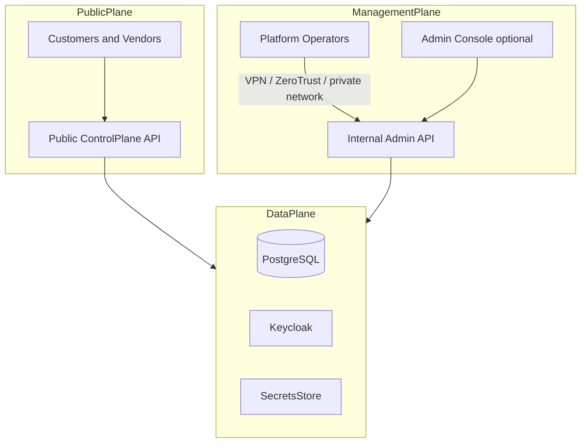
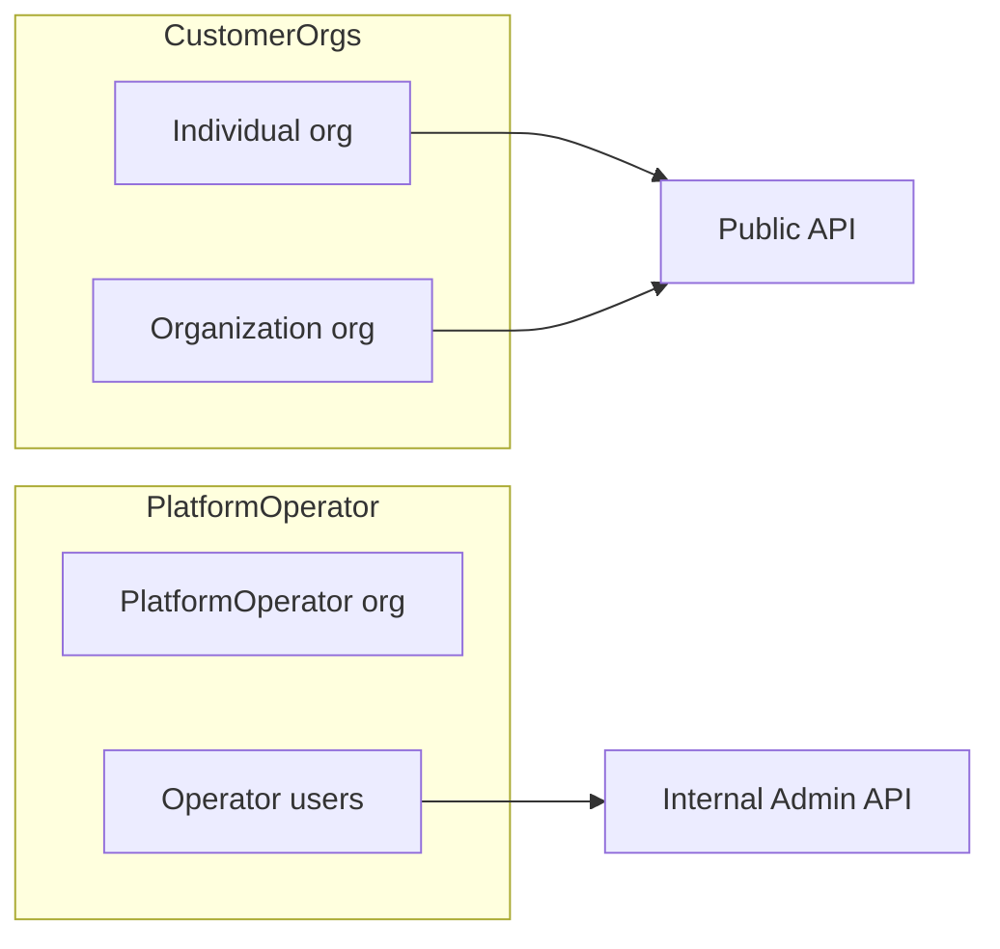
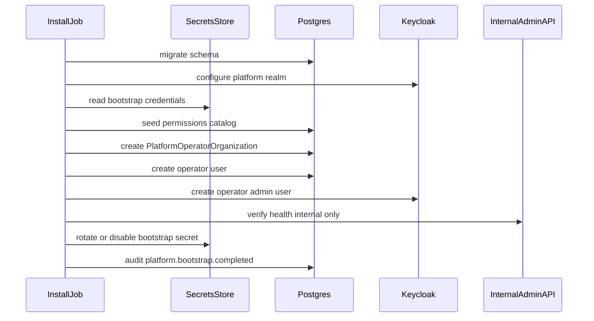

# Management plane (platform administration and secure operations)

This document defines how the **SaaS control-plane** is operated by platform staff separately from customer and vendor usage on the **public control plane**. It complements the [system overview](system-overview.md).

## Deployment model (this project)

| Surface | Exposure | Users |
|---------|----------|-------|
| **Public control plane API** | Internet (TLS, WAF, rate limits) | Customers, vendors, tenant automation |
| **Management plane (admin API)** | **Not** on public internet | Platform operators only |
| **Data plane** | Private network only | Applications only (no direct customer access) |

Operators reach the management plane via **VPN**, **zero-trust** access (e.g., Cloudflare Access, BeyondCorp), or **private connectivity** (PrivateLink, internal LB)—not via the same public hostname as customer APIs.

---

## Three planes

| Plane | Purpose | Must not |
|-------|---------|----------|
| **Public** | Tenant lifecycle, marketplace, allocations, org/vendor registration | Expose `platform.*` admin routes or bootstrap endpoints |
| **Management** | Vendor verification, plugin approval, tenant suspend, global config, break-glass | Be reachable without network + identity controls beyond customer auth |
| **Data** | Persistence and identity provider | Have public IPs for DB/Keycloak admin |

Customer RBAC (`tenant.admin`, `resource.*`) must **never** grant platform-wide powers. See [authorization domain](../domains/authorization-domain.md) for `platform` scope.

---

## Platform Operator organization

The entity responsible for operating the SaaS is modeled like customer organizations, using the same `org_type` vocabulary:

| Operator entity | `org_type` | Example | Identity |
|-----------------|------------|---------|----------|
| Solo operator | `individual` | Founder / small team | Platform Keycloak realm |
| Operations company | `organization` | “Acme Cloud Ops” | Dedicated operator org realm (optional) |

### `PlatformOperatorOrganization`

Represented in the Tenant domain as an `Organization` with:

- `is_platform_operator = true` (or dedicated type flag)
- Typically **one** (or very few) per SaaS deployment
- Members receive **platform-scoped** roles only on the **internal Admin API**

Platform Operator orgs are **not** customer tenants. They do not consume marketplace offerings as the primary model; they govern the platform.

---

## Bootstrap at install (one-time)

On first deploy (empty database, fresh Keycloak), an **install job** must:

1. Run database migrations.
2. Configure platform Keycloak realm (and operator client).
3. Seed global permission catalog (including `platform.*`).
4. Create `PlatformOperatorOrganization` (`individual` or `organization` per install policy).
5. Create first human operator user (invite, not shared password in git).
6. Verify internal Admin API health (management network only).
7. **Rotate or disable** ephemeral `bootstrap-admin` credentials.
8. Append audit `platform.bootstrap.completed`.

| Phase | Actor | Access |
|-------|-------|--------|
| Install / bootstrap | `bootstrap-admin` (ephemeral) | Management network; credentials from sealed secrets / KMS |
| Steady state | Platform Operator org members | Admin API + operator Keycloak client |
| Emergency | break-glass account | Dual-control, time-limited, full audit |

Analogies: OpenShift `cluster-admin` bootstrap; AWS root → Organizations admin then lock root; Kubernetes initial `cluster-admin` binding.

**Rule:** bootstrap credentials are **not** valid on the public API after bootstrap completes.

---

## Bootstrap sequence

---

## Deployment topology (SaaS)

| Component | Network placement | Notes |
|-----------|-------------------|-------|
| Public API (FastAPI) | Public ingress / DMZ | Customer routes only; `ADMIN_ENABLED=false` |
| Internal Admin API | Private subnet | Same codebase optional: separate process or router; `ADMIN_ENABLED=true` |
| Admin UI (optional) | Private subnet | Calls Admin API only |
| PostgreSQL | Private subnet | No public IP |
| Keycloak | Private subnet | Customer realms via public API token exchange; Keycloak **admin console** not on internet |
| Secrets (Vault/KMS) | Private | Bootstrap, plugin credentials, break-glass |

### Access paths for operators

| Method | When |
|--------|------|
| Corporate VPN into management VPC/VNet | Traditional enterprise |
| Zero-trust (SSO + device posture) | Modern SaaS ops |
| Bastion / SSM session | Break-glass only |

---

## Authorization on the management plane

Platform permissions use scope **`platform`** (not `tenant_id`). Examples:

| Permission | Purpose |
|------------|---------|
| `platform.admin` | Full platform configuration |
| `platform.tenant.suspend` | Suspend abusive or non-paying tenant |
| `platform.vendor.verify` | Verify vendor identity |
| `platform.plugin.approve` | Approve plugin version for marketplace |
| `platform.audit.read` | Read cross-tenant audit (support/compliance) |
| `platform.support` | Read-only support operations (JIT elevated) |

**Rules:**

- Assignable only to users in `PlatformOperatorOrganization`.
- Admin API middleware rejects tokens without valid `platform.*` permission for the route.
- Public API middleware **rejects** any request presenting only `platform.*` context on customer hostnames (defense in depth).

Full catalog: [authorization domain](../domains/authorization-domain.md).

---

## Operational security practices

| Practice | Purpose |
|----------|---------|
| Separate admin API deployment or ingress | No `/v1/platform/*` on public load balancer |
| Separate Keycloak client for operators | Customer JWT cannot call admin routes |
| MFA + SSO for `platform.admin` | Required for production |
| Just-in-time elevation | `platform.support` time-bound |
| Immutable audit log | Every platform action recorded |
| Separation of duties | Plugin approve ≠ vendor verify ≠ security revoke |
| No bootstrap password in git | Init job + sealed secrets + immediate rotation |

Comparable models: AWS management account vs member accounts; GCP organization admin vs project IAM; OpenShift cluster-admin vs namespace admin.

---

## Implementation shape (later phases)

| Approach | Description |
|----------|-------------|
| Single monolith, two processes | `public-api` and `admin-api` share `src/` domain modules |
| Single monolith, feature flag | `ADMIN_ENABLED` + separate ingress (weaker; prefer split ingress) |
| Shared `User` table | Operators are normal users with Platform Operator org membership |

Identity details: [identity domain](../domains/identity-domain.md) (operator realm/client, bootstrap lifecycle).

Tenant model: [tenant domain](../domains/tenant-domain.md) (`is_platform_operator`, operator org workflows).

---

## Related documentation

- [System overview](system-overview.md)
- [Identity domain](../domains/identity-domain.md)
- [Tenant domain](../domains/tenant-domain.md)
- [Authorization domain](../domains/authorization-domain.md)
