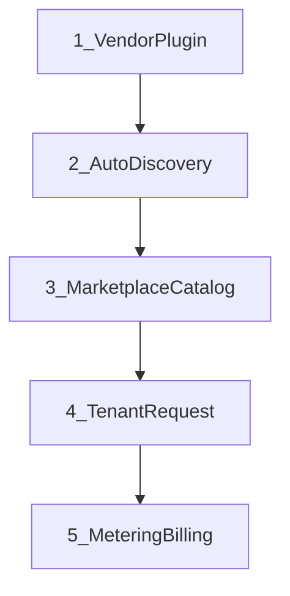

# General Multi-Tenant Marketplace Platform — Master Plan

Canonical index for the platform architecture. For a **single collective overview**, see [system-overview2.md](system-overview2.md). Detailed domain docs live under [`docs/domains/`](../domains/) and [`docs/workflows/`](../workflows/).

**Commercial model:** **Subscription + usage** (plan + metered dimensions).

## Vision

A **multi-tenant control-plane** where organizations **consume** marketplace offerings and **optionally publish** them **through versioned plugins**, with **platform operators** on a **management plane**, and **usage metered** for billing.

## Architectural planes

| Plane | Exposure | Capabilities |
|-------|----------|--------------|
| Public control plane | Internet | Identity, tenant, marketplace, vendor publish, tenant install/provision |
| Management plane | VPN / zero-trust | Vendor verify, plugin approve, tenant suspend |
| Data plane | Private | PostgreSQL, Keycloak, secrets |

See [management-plane.md](management-plane.md), [system-overview.md](system-overview.md).

## Bounded contexts

| Context | Doc | Phase |
|---------|-----|-------|
| Identity | [identity-domain.md](../domains/identity-domain.md) | A |
| Tenant | [tenant-domain.md](../domains/tenant-domain.md) | A |
| Authorization | [authorization-domain.md](../domains/authorization-domain.md) | A |
| Resource | [resource-domain.md](../domains/resource-domain.md) | A |
| Audit | [phase2-foundation-overview.md](phase2-foundation-overview.md) | A |
| Marketplace / Vendor Plugin | [vendor-plugin-domain.md](../domains/vendor-plugin-domain.md) | B |
| Billing | [billing-domain.md](../domains/billing-domain.md) | C |
| Metering | [metering-domain.md](../domains/metering-domain.md) | C |

## Canonical marketplace journey

| Stage | Entities |
|-------|----------|
| Vendor Plugin | `ServicePlugin`, `PluginVersion` |
| Auto Discovery | `Capability`, `AdapterRegistry` |
| Marketplace Catalog | `Product`, `MarketplaceOffering`, `Plan` |
| Tenant Request | `Entitlement`, `ProvisioningRequest`, `Resource` |
| Metering / Billing | `UsageEvent`, `Subscription` |

**Invariant:** Products publish only through a **published** `PluginVersion`.

Workflows: [vendor-plugin-e2e-acme-metrics.md](../workflows/vendor-plugin-e2e-acme-metrics.md), [marketplace-tenant-lifecycle.md](../workflows/marketplace-tenant-lifecycle.md).

## Phased roadmap

| Phase | Goal | Code module |
|-------|------|-------------|
| **A — Foundation** | Identity, tenant, RBAC, resource, audit | `identity`, `tenant`, `authorization`, `resource`, `audit` |
| **B — Marketplace** | Plugin → discovery → catalog → provision | `marketplace` |
| **C — Commercial** | Subscription + usage metering | `billing`, `metering` |
| **D — Enterprise** | ReBAC, async provision, outbox | future |
| **E — Scale** | External plugin runtime, payments | future |

Implementation layout: [phase2-backend-structure.md](phase2-backend-structure.md) (extended with marketplace/billing/metering).

## Decision log

| ID | Decision |
|----|----------|
| M1 | Plugin-first publishing |
| M2 | Auto-discovery on version submit/approve |
| M3 | Subscription + usage billing |
| M4 | Split public vs management plane |
| M5 | Modular monolith |
| M6 | Platform operator org same `org_type` model |
| M7 | Append-only usage events with idempotency |

## Diagrams

- [marketplace-platform-context.md](../diagrams/marketplace-platform-context.md)
- [marketplace-commercial-flow.md](../diagrams/marketplace-commercial-flow.md)

## Related

- [Phase 2 foundation](phase2-foundation-overview.md)
- [docs README](../README.md)
