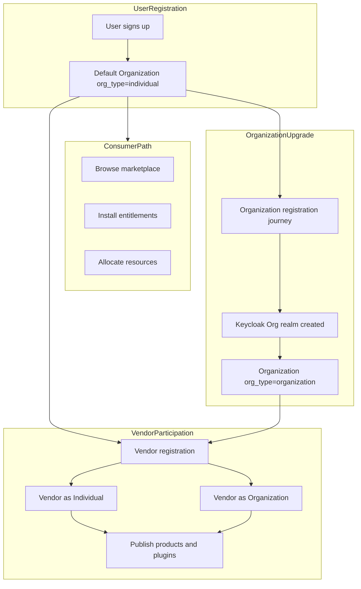
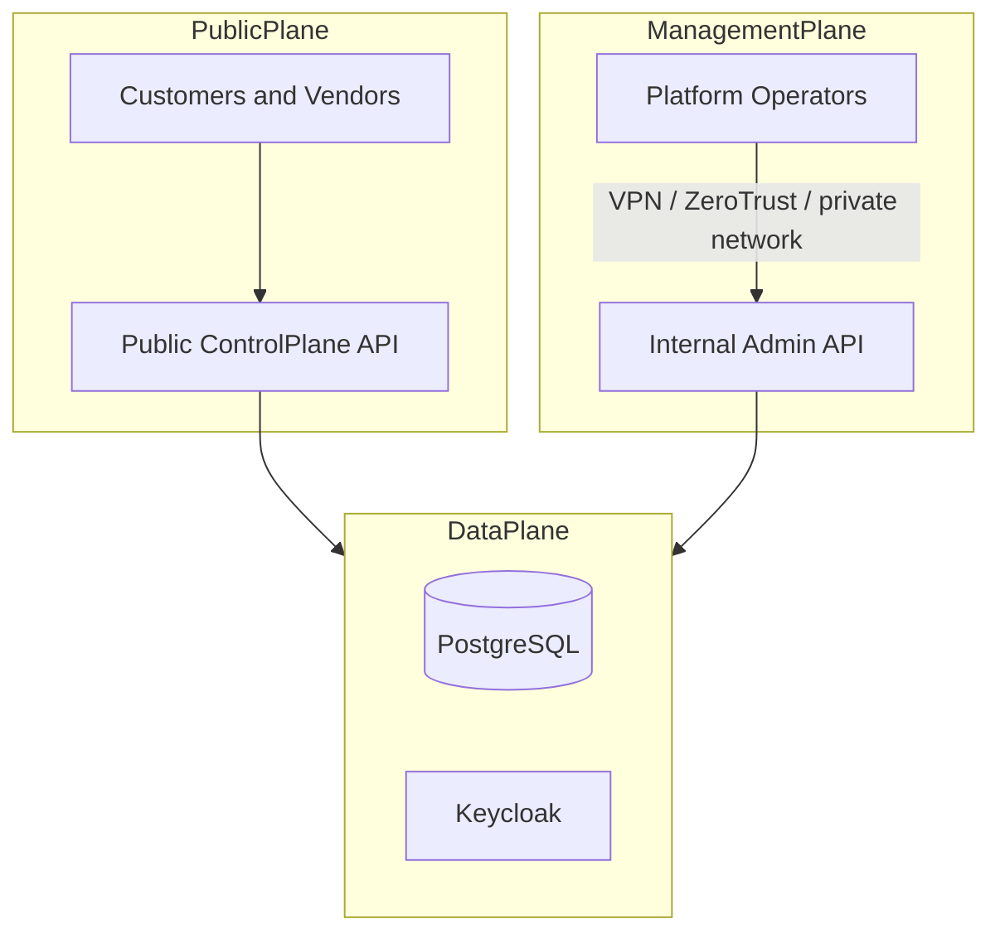
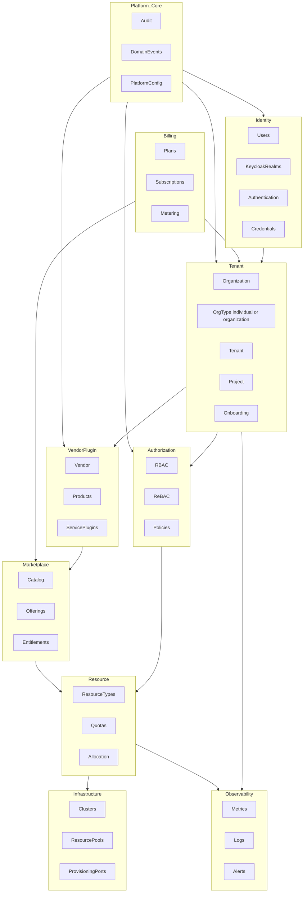

# System overview (Phase 1)

> **Collective reference:** For the full synthesized overview (architecture + domains + marketplace + implementation status), see [system-overview2.md](system-overview2.md).

## Platform vision: tenant control-plane for service providers

This platform is a **tenant control-plane** that any **service provider entity** can consume. It is not only a SaaS product for end customers—it is the shared foundation on which **consumers** and **vendors** operate on the same plane.

| Actor | Role on the platform | What they do |
|-------|----------------------|--------------|
| **User (consumer)** | Registers to consume products and services | Browse marketplace, install offerings, allocate resources, manage tenants/projects |
| **User (vendor)** | Participates as a provider after opting in | **Publish products on the marketplace through plugins** (register plugin → approved version → product → offering), then fulfill provisioning |
| **Organization** | Legal or logical anchor for identity, billing, and governance | Owns tenants, vendor profile, and (for `Organization` type) a dedicated identity realm |

Every registered user starts as an **Individual**. From there they can:

1. **Consume** platform products and services (default path).
2. **Upgrade to an Organization** (`org_type = organization`)—creating a new **Keycloak organization realm** as part of the registration journey.
3. **Become a Vendor** with either `org_type = individual` or `org_type = organization`.

---

## Purpose

Phase 1 delivers the **control-plane foundation** of this modular, enterprise **multi-tenant service provider platform**:

- **Who** is calling: Identity (users, organizations, Keycloak realms, sessions)
- **Where** actions occur: Tenant hierarchy (Organization → Tenant → Project)
- **What role they play**: Consumer, vendor, or both (participation model)
- **What** is allowed: Authorization (RBAC + limited ReBAC)
- **How** capacity is granted: Resource types, quotas, allocation workflow
- **How** offerings are delivered: Marketplace + vendor plugins (modeled; thin in early phases)
- **How** it is governed/operated: Audit + domain events + observability metadata

Non-goals in Phase 1:

- No frontend
- No Kubernetes manifests/operators
- No microservices split
- No production deployment
- No payment processor integration

---

## Organization types and identity realms

The platform distinguishes **organization type** from **vendor participation**. They are related but not identical.

| Concept | Values | Meaning |
|---------|--------|---------|
| `org_type` | `individual` \| `organization` | How the entity is registered and governed |
| `participation` | `consumer` \| `vendor` \| `consumer_and_vendor` | Whether the entity consumes, provides, or both |
| Keycloak realm | platform realm + optional org realm | Where authentication and org-scoped identity live |

### Default: Individual organization

On **user registration**:

- A platform `User` record is created.
- A default **`Organization`** is created with `org_type = individual`.
- The user is the owner of that individual organization (via membership).
- A default **Tenant** (and optionally Project) may be seeded for consumption.
- Authentication uses the **platform Keycloak realm** (no separate org realm yet).

This matches a single person consuming services without forming a company entity.

### Upgrade: Organization type = Organization

When a user chooses to participate as a **company or structured entity**:

1. User starts an **Organization registration journey** (legal name, slug, contacts, policies).
2. Platform provisions a **new Keycloak organization realm** bound to that organization.
3. Platform creates an **`Organization`** with `org_type = organization` and stores `keycloak_realm_id` (or equivalent external ref).
4. User becomes org owner; additional members can be invited into the org realm.
5. Tenants under that organization inherit org-scoped identity and governance.

This is the enterprise path: multiple users, org admins, and org-scoped vendor operations.

### Vendor participation (Individual or Organization)

Any user may **opt in to vendor participation**:

| Vendor profile | `org_type` | Identity realm | Typical use |
|----------------|------------|----------------|-------------|
| Individual vendor | `individual` | Platform realm | Solo provider, indie integrations, personal offerings |
| Organization vendor | `organization` | Org Keycloak realm | Company publishing products, team-managed plugins |

Vendor registration and publishing (conceptual steps):

1. User (or org admin) requests vendor participation.
2. Platform creates or activates a **`Vendor`** profile linked to the owning `Organization`.
3. Platform assigns vendor-scoped permissions (RBAC) and audit obligations.
4. Vendor **publishes via plugin** (required order):
   - Register **`ServicePlugin`** and submit **`PluginVersion`** (signed artifact + capabilities).
   - Platform approves plugin version for marketplace.
   - Create **`Product`** linked to that plugin (marketplace listing).
   - Create **`MarketplaceOffering`** pointing at the published plugin version.
5. Tenants discover offerings, install entitlements, and provision through the plugin adapter.

See [vendor-plugin domain](../domains/vendor-plugin-domain.md) — *Core rule: vendors publish products through plugins*.

A single human can therefore:

- Consume services under their individual org, **and**
- Publish services as an individual vendor, **or**
- Form an organization, get an org realm, and publish as an organization vendor.

---

## Public, management, and data planes (SaaS operations)

Customer and vendor activity uses the **public control plane**. Operating the SaaS itself uses a separate **management plane** (not on the public internet).

| Plane | Who | Exposure |
|-------|-----|----------|
| **Public** | Registered consumers and vendors | Internet (TLS, WAF) |
| **Management** | Platform Operator org members | VPN / zero-trust / private network only |
| **Data** | Applications | Private subnets; no public DB/Keycloak admin |

At **install**, an ephemeral bootstrap principal seeds the first **Platform Operator** organization (`org_type` individual or organization), then credentials are rotated. Customer `tenant.admin` never implies `platform.admin`.

Full detail: [management-plane.md](management-plane.md).

---

## Architecture principles

- **Modular monolith, domain-first**: one deployable artifact; strict bounded-context boundaries internally.
- **API-first + CLI-first**: OpenAPI is the contract; CLI mirrors API use cases.
- **Tenant isolation by default**: shared PostgreSQL with `tenant_id` + PostgreSQL **RLS** for tenant-scoped tables.
- **Consumer and vendor on one control-plane**: same identity, tenant, authorization, resource, and audit foundations; vendor/marketplace layers extend—not fork—the model.
- **Organization type drives identity topology**: `individual` stays in platform realm; `organization` gets a dedicated Keycloak org realm.
- **Auditability**: all security-sensitive actions emit audit entries (registration, org upgrade, vendor activation, provisioning).
- **Event-driven integration between domains**: outbox pattern for cross-context workflows.
- **Split public and management planes**: customer API on public ingress; platform administration on internal admin API only ([management-plane.md](management-plane.md)).

---

## Bounded contexts (Phase 1)

---

## Core domain workflows (Phase 1)

### User registration (consumer by default)

- Create `User` + default `Organization` (`org_type = individual`).
- Seed default tenant/project for consumption.
- Assign consumer RBAC roles; audit `user.registered`.

### Organization registration (upgrade to `organization`)

- Validate org registration inputs.
- **Provision Keycloak org realm**; store realm reference on `Organization`.
- Set `org_type = organization`; migrate or attach tenants.
- Assign org-admin roles; audit `organization.registered` and `keycloak.realm.created`.

### Vendor registration (participation)

- Link `Vendor` to owning `Organization` (individual or organization type).
- Enable vendor RBAC permissions; audit `vendor.activated`.
- For organization vendors, org realm admins may delegate vendor operators.

### Tenant onboarding

- Create org/tenant/project → seed role bindings → seed quota policies → attach trial subscription → audit.

### Authentication

- **Individual org**: login via platform Keycloak realm → JWT → API/CLI.
- **Organization org**: login via org Keycloak realm (or federated from platform, depending on integration design) → JWT with org context.

### Authorization

- Evaluate RBAC bindings (+ limited ReBAC) at org/tenant/project scope.
- Vendor actions require vendor-scoped permissions in addition to tenant membership where applicable.

### Resource allocation (consumer)

- Check entitlement (optional) → reserve quota → approval (optional) → provision via infrastructure port → activate instance.

### Marketplace provisioning (vendor → consumer)

- Consumer installs offering → entitlement → plugin dispatch → resource creation → audit (see [vendor-plugin domain](../domains/vendor-plugin-domain.md)).

### Platform bootstrap (install-time)

- Install job on management network → seed permissions → create Platform Operator org → first operator user → disable bootstrap credentials → audit `platform.bootstrap.completed` (see [management-plane.md](management-plane.md)).

### Platform operations (steady state)

- Operators authenticate via management plane → `platform.*` RBAC → vendor verify, plugin approve, tenant suspend, cross-tenant audit.

---

## Multi-tenant isolation strategy

- **Request**: JWT + required tenant context headers (e.g., `X-Tenant-Id`) and correlation id.
- **Application**: domain services require `TenantContext` (org_id, org_type, tenant_id, project_id); no cross-tenant repository methods.
- **Identity**: individual orgs share platform realm; organization orgs use dedicated Keycloak realms—platform stores mapping, not duplicate credentials.
- **Vendor scope**: vendor operations are always scoped to the owning organization and the tenants they administer; cross-org vendor access is denied by default.
- **Database**: tenant-scoped tables have `tenant_id` and PostgreSQL **RLS**. Global catalogs (permissions, resource types) are read-only and do not include `tenant_id`.

---

## Entity relationships (platform model)

| From | To | Cardinality | Notes |
|------|-----|-------------|-------|
| User | Organization | N:M via membership | default org on signup is `individual` |
| Organization | Tenant | 1:N | consumer and vendor workloads live in tenants |
| Organization | Vendor | 0..1 | vendor participation is optional |
| Organization | Keycloak realm | 0..1 | realm created when `org_type = organization` |
| Vendor | Product / Plugin | 1:N | vendor publishes into marketplace |
| Tenant | Entitlement | 1:N | consumer installs offerings |
| User | Vendor operator | indirect | via org membership + RBAC |

---

## Related documentation

- Management plane (bootstrap, VPN, platform operator): [management-plane.md](management-plane.md)
- Tenant hierarchy and membership: [tenant-domain.md](../domains/tenant-domain.md)
- Identity and Keycloak: [identity-domain.md](../domains/identity-domain.md)
- Authorization (tenant + platform scope): [authorization-domain.md](../domains/authorization-domain.md)
- Vendor plugins and marketplace provisioning: [vendor-plugin-domain.md](../domains/vendor-plugin-domain.md)
- Phase 2 minimal foundation (implementation planning): [phase2-foundation-overview.md](phase2-foundation-overview.md)
