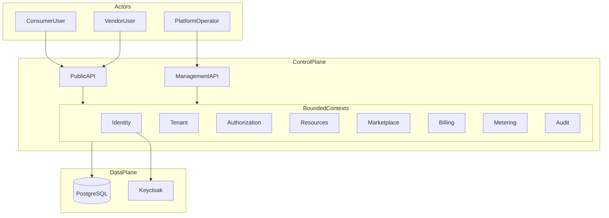
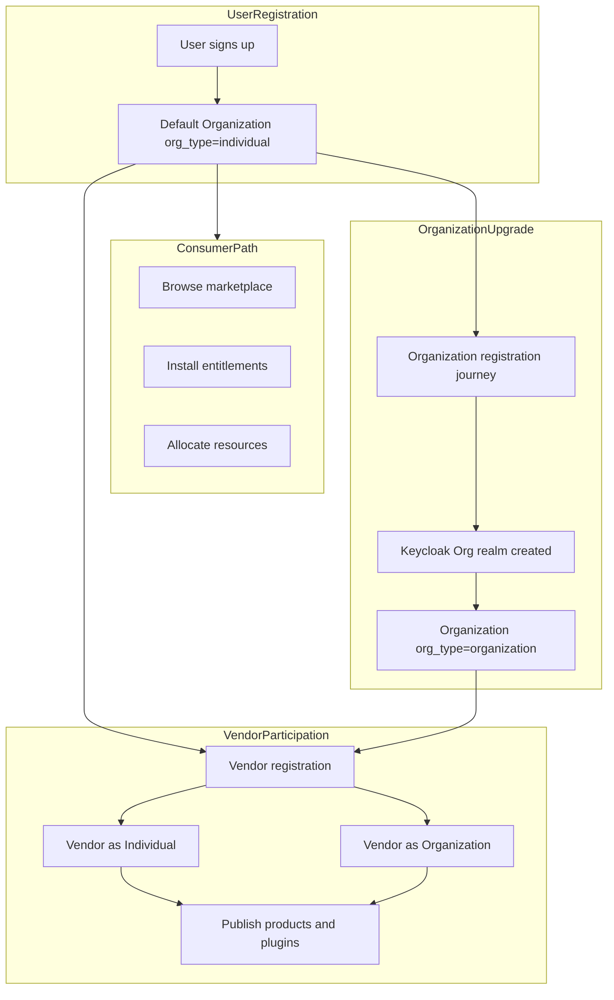
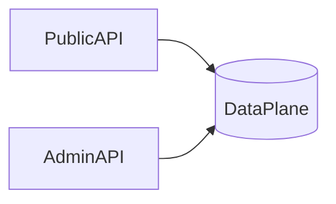
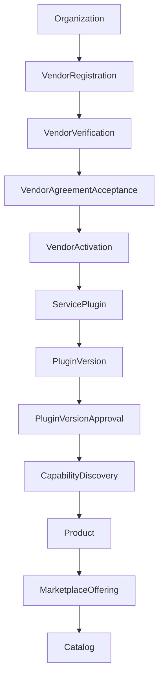
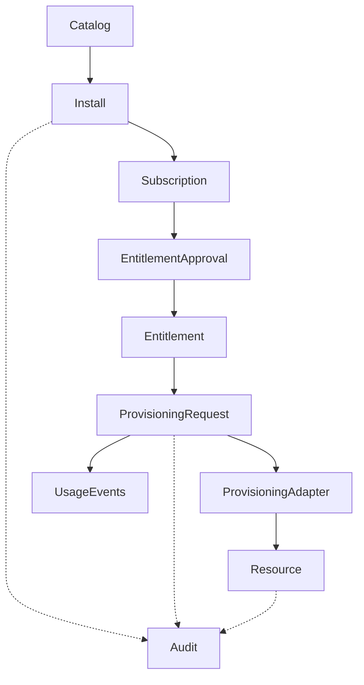
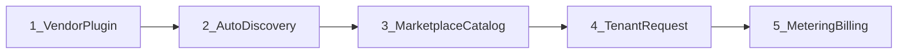

# System overview 2 — collective platform reference

This document is the **single consolidated overview** of the multi-tenant marketplace control-plane. It synthesizes architecture, domains, workflows, commercial model, and implementation status.

**Aligned with:** [system-overview.md](system-overview.md) — same actor model, `org_type` vocabulary (`individual` | `organization`), and participation model (`consumer` | `vendor` | `consumer_and_vendor`). This doc extends that foundation with marketplace, billing, and implementation detail.

**Commercial model:** subscription + usage (base plan + metered dimensions).

**Implementation:** modular monolith (FastAPI + PostgreSQL + async SQLAlchemy) under [`src/`](../../src/). Journey-driven DDD rebuild in progress (Identity J1–J6 live; see [identity ARCHITECTURE](../../src/identity/ARCHITECTURE.md)).

---

## 1) Vision and positioning

This platform is a **tenant control-plane** that any **service provider entity** can consume. It is not only a SaaS product for end customers—it is the shared foundation on which **consumers** and **vendors** operate on the **same plane**.

| Actor | Role on the platform | What they do |
|-------|----------------------|--------------|
| **User (consumer)** | Registers to consume products and services | Browse marketplace, install offerings, allocate resources, manage tenants/projects |
| **User (vendor)** | Participates as a provider after opting in | Publish products **through plugins** (register → approve → product → offering), fulfill provisioning |
| **Organization** | Legal or logical anchor for identity, billing, and governance | Owns tenants, optional vendor profile, and (when `org_type = organization`) a dedicated Keycloak org realm |

A **consumer** is always a **user acting through an organization**. That organization may be:

- **`org_type = individual`** — solo consumer (default on signup; platform Keycloak realm), or
- **`org_type = organization`** — enterprise consumer (team, org realm, multiple members and tenants).

The same split applies to **vendors** (solo individual vendor vs organization vendor). See §2.

Comparable to AWS Marketplace + Terraform providers + OpenShift operators + SaaS billing meters — delivered initially as one deployable modular monolith.



---

## 2) Actors, organization types, and participation

Every registered user starts as an **Individual**. From there they can:

1. **Consume** platform products and services (default path)—as an **individual** or **organization** consumer.
2. **Upgrade to an Organization** (`org_type = organization`)—creating a **Keycloak organization realm** as part of the registration journey.
3. **Become a Vendor** with either `org_type = individual` or `org_type = organization`.



### Organization type vs participation

These concepts are **related but not identical** (same as [system-overview.md](system-overview.md)):

| Concept | Values | Meaning |
|---------|--------|---------|
| `org_type` | `individual` \| `organization` | How the entity is registered and governed |
| `participation` | `consumer` \| `vendor` \| `consumer_and_vendor` | Whether the entity consumes, provides, or both |
| Keycloak realm | platform realm + optional org realm | Where authentication and org-scoped identity live |

### Consumer (user) — individual or organization

| Consumer profile | `org_type` | `participation` | Identity realm | Typical use |
|------------------|------------|-----------------|----------------|-------------|
| **Solo consumer** | `individual` | `consumer` | Platform Keycloak realm | Single person browsing, installing, using services |
| **Enterprise consumer** | `organization` | `consumer` | Org Keycloak realm | Company team with multiple users, tenants, and projects |

**Default: individual consumer**

On user registration:

- A platform `User` is created.
- A default `Organization` is created with `org_type = individual` and `participation = consumer`.
- The user owns that individual organization via membership.
- A default **Tenant** is seeded for consumption.
- Authentication uses the **platform Keycloak realm** (no separate org realm yet).

**Upgrade: organization consumer**

When a user forms a **company or structured entity**:

1. User starts an **organization registration journey** (legal name, slug, contacts).
2. Platform provisions a **Keycloak organization realm** bound to that organization.
3. Platform creates an `Organization` with `org_type = organization`; stores `keycloak_realm_ref`.
4. User becomes org owner; members are invited into the org realm.
5. Tenants under that organization inherit org-scoped identity and governance.

Consumer actions (browse catalog, install offerings, allocate resources) always occur **in a tenant** belonging to the consumer’s organization—whether individual or organization type.

### Vendor — individual or organization

| Vendor profile | `org_type` | `participation` | Identity realm | Typical use |
|----------------|------------|-----------------|----------------|-------------|
| **Individual vendor** | `individual` | `vendor` or `consumer_and_vendor` | Platform realm | Solo ISV, indie integrations |
| **Organization vendor** | `organization` | `vendor` or `consumer_and_vendor` | Org Keycloak realm | Company publishing plugins with a team |

Vendor opt-in creates a **`Vendor`** profile linked to the owning `Organization`, then publishing follows the plugin-first pipeline (§6).

### Platform operator and partners

| Actor | `org_type` | Primary surface |
|-------|------------|-----------------|
| Platform staff | `individual` or `organization` (`is_platform_operator = true`) | Management API only |
| Channel partner (future) | `organization` | Public + partner APIs |

### All participation possibilities (over time)

- Solo **consumer** (default individual org on signup)
- **Enterprise consumer** (organization org + many tenants/projects)
- Solo **vendor** (individual vendor publishing plugins)
- **Enterprise vendor** (organization vendor + team operators)
- Same human as **consumer and vendor** (different orgs or `consumer_and_vendor` on one org)
- **Platform operator org** (not a customer tenant)

A single human can therefore:

- Consume under their **individual** org, **and**
- Publish as an **individual** vendor, **or**
- Form an **organization**, get an org realm, and consume or publish as an **organization** entity.

Detail: [tenant-domain.md](../domains/tenant-domain.md), [identity-domain.md](../domains/identity-domain.md).

---

## 3) Architectural planes

| Plane | Exposure | Capabilities | Must never |
|-------|----------|--------------|------------|
| **Public control plane** | Internet (TLS, WAF) | Identity, tenant, marketplace, vendor publish, install/provision, tenant RBAC | Expose `platform.*` admin routes |
| **Management plane** | VPN / zero-trust / private network | Vendor verify, plugin approve, tenant suspend, bootstrap, global config | Share public ingress with customer API |
| **Data plane** | Private | PostgreSQL, Keycloak, secrets, (future) plugin artifact store | Public DB/Keycloak admin |



**Invariant:** `tenant.admin` ≠ `platform.admin`. Customer RBAC never grants cross-tenant platform powers.

Detail: [management-plane.md](management-plane.md).

---

## 4) Bounded contexts

| Context | Responsibility | Doc | Code package |
|---------|----------------|-----|--------------|
| **Identity** | Users, credentials, Keycloak realms, bootstrap auth | [identity-domain.md](../domains/identity-domain.md) | `identity` |
| **Tenant** | Organization, tenant, membership, vendor profile, org upgrade | [tenant-domain.md](../domains/tenant-domain.md) | `tenant` |
| **Authorization** | RBAC (tenant + vendor + platform scope); ReBAC later | [authorization-domain.md](../domains/authorization-domain.md) | `authorization` |
| **Resources** | Resources, quotas, allocations (platform capacity) | [resource-domain.md](../domains/resource-domain.md) | `resources` |
| **Audit** | Append-only security-sensitive action log | [phase2-foundation-overview.md](phase2-foundation-overview.md) | `audit` |
| **Marketplace / Vendor plugin** | Plugin, discovery, catalog, entitlement, provisioning | [vendor-plugin-domain.md](../domains/vendor-plugin-domain.md) | `marketplace` |
| **Billing** | Plans, subscriptions, invoice preview | [billing-domain.md](../domains/billing-domain.md) | `billing` |
| **Metering** | Meters, usage events, aggregation | [metering-domain.md](../domains/metering-domain.md) | `metering` |
| **Shared core** | DB session, base models, timestamps | [phase2-backend-structure.md](phase2-backend-structure.md) | `core` |
| **Bootstrap** | FastAPI app, settings, deps, middleware | [phase2-backend-structure.md](phase2-backend-structure.md) | `bootstrap` |

Future (documented, not built): Infrastructure (K8s ports), Observability, Event outbox, ReBAC (SpiceDB).

---

## 5) Core entity model (platform-wide)

### Identity and tenant

| Entity | Purpose | Key attributes |
|--------|---------|----------------|
| `User` | Human principal | `email`, `password_hash`, `status` |
| `Organization` | Top-level customer/vendor anchor | `org_type`, `participation`, `keycloak_realm_ref`, `is_platform_operator` |
| `Tenant` | Primary isolation boundary | `organization_id`, `slug`, `status` |
| `TenantMembership` | User ↔ tenant | `user_id`, `tenant_id`, `status` |
| `Vendor` | Publishing profile | `organization_id`, `status`, `verified_at` |

**Consumer path:** `User` → `TenantMembership` → `Tenant` → `Organization`. The organization’s `org_type` determines whether the consumer is **individual** (platform realm, default on signup) or **organization** (org realm after upgrade). Marketplace installs and resource allocations are always **tenant-scoped**.

**Entity relationships (summary):**

| From | To | Notes |
|------|-----|-------|
| User | Organization | N:M via membership; default org on signup is `individual` |
| Organization | Tenant | 1:N; consumer workloads live in tenants |
| Organization | Vendor | 0..1; optional vendor participation |
| Organization | Keycloak realm | 0..1; realm when `org_type = organization` |
| Tenant | Entitlement | 1:N; consumer installs offerings |

### Authorization

| Entity | Purpose |
|--------|---------|
| `Permission` | Atomic right (`code`, `scope`: tenant / vendor / platform) |
| `Role` | Named bundle (tenant-scoped or platform-scoped) |
| `RolePermission` | Role ↔ permission |
| `UserRole` | User ↔ role within tenant (or platform sentinel) |

### Resources (platform capacity)

| Entity | Purpose |
|--------|---------|
| `Resource` | Tenant-owned asset (`resource_type`, `external_ref`, optional `entitlement_id`) |
| `Quota` | Limit per tenant + resource type |
| `ResourceAllocation` | Quota consumption record |

### Marketplace (plugin-first)

| Entity | Purpose |
|--------|---------|
| `ServicePlugin` | Vendor technical product family |
| `PluginVersion` | Shippable manifest + artifact; governance lifecycle |
| `Capability` | Indexed operation surface from manifest |
| `AdapterRegistry` | Route to provisioning adapter (stub → HTTP/gRPC) |
| `Product` | Market-facing listing **bound to plugin** |
| `MarketplaceOffering` | Installable SKU: `plan_id`, `meter_codes[]`, `plugin_version_id` |
| `Entitlement` | Tenant install right |
| `ProvisioningRequest` | Idempotent provision job |

**Invariant M1:** No published product/offering without a **published** `PluginVersion`.

### Commercial

| Entity | Purpose |
|--------|---------|
| `Plan` | Subscription template (base price, included units) |
| `Subscription` | Tenant contract linked to entitlement |
| `Meter` | Billable dimension (from manifest or offering) |
| `UsageEvent` | Append-only usage reading (idempotent) |
| `UsageAggregation` | Period rollup for rating |
| `InvoicePreview` | Estimated charges (no payment gateway yet) |

### Audit

| Entity | Purpose |
|--------|---------|
| `AuditLog` | `action`, `tenant_id`, `actor_user_id`, `resource_type`, `details_json`, `correlation_id` |

---

## 6) Canonical pipelines

### 6.1 Supply side — vendor to catalog

Target product pipeline (full governance; partial in code today):



| Step | Actor | Outcome |
|------|-------|---------|
| Vendor registration | Vendor user | `Vendor` created, `participation` updated |
| Vendor verification | Platform operator | Trust check (`platform.vendor.verify`) |
| Agreement acceptance | Vendor legal contact | Terms on record (planned) |
| Vendor activation | Platform / policy | `Vendor.status = active` |
| Plugin + version | Vendor engineer | Manifest with capabilities + meters |
| Plugin approval | Platform operator | `published`; discovery runs (**M2**) |
| Product + offering | Vendor PM | Commercial SKU with plan + meters |
| Catalog | Platform | Published read model |

**Implemented today:** registration (simplified), plugin, version submit, admin approve, discovery, product, offering, catalog list. **Not yet:** verify/agreement gates, rejection notes, vendor activation workflow.

Reference journey: [vendor-plugin-e2e-acme-metrics.md](../workflows/vendor-plugin-e2e-acme-metrics.md).

### 6.2 Demand side — tenant install to resource



| Step | Outcome |
|------|---------|
| Browse catalog | Filter offerings by capability, vendor |
| Install | Entitlement + subscription (`trialing` or `active`) |
| Approval (optional) | Enterprise policy before active entitlement |
| Provision | Adapter dispatch; `Resource` created |
| Metering | Usage events on provision (**M7** idempotency) |
| Billing | Invoice preview from plan + usage |

**Implemented today:** install → subscription → provision (stub adapter) → resource + usage events + invoice preview. **Not yet:** entitlement approval gate, deprovision/uninstall, time-meter scheduler.

Detail: [marketplace-tenant-lifecycle.md](../workflows/marketplace-tenant-lifecycle.md).

### 6.3 Five-stage marketplace journey (engineering index)



Index: [marketplace-platform-master.md](marketplace-platform-master.md).

---

## 7) Authorization

### Scopes

| Scope | Examples | API surface |
|-------|----------|-------------|
| `tenant` | `tenant.admin`, `resource.allocate`, `marketplace.install` | Public |
| `vendor` | `vendor.plugin.register`, `vendor.offering.publish` | Public (vendor org) |
| `platform` | `platform.plugin.approve`, `platform.vendor.verify`, `platform.tenant.suspend` | Management only |

### Principles

- JWT carries `sub` (user id) only — **no embedded roles**; RBAC checked per request from DB.
- Default deny.
- Platform permissions evaluated only on admin API.

Detail: [authorization-domain.md](../domains/authorization-domain.md).

---

## 8) Commercial model (subscription + usage)

| Layer | Owner | Customer sees |
|-------|-------|---------------|
| **Plan** | Billing | Base fee + included quotas |
| **Offering** | Marketplace | SKU linking plan + meters + plugin version |
| **Entitlement** | Marketplace | Install right |
| **Subscription** | Billing | Contract state |
| **UsageEvent** | Metering | Billable consumption |
| **InvoicePreview** | Billing | Period estimate (payments deferred) |

### Subscription states

`trialing` → `active` → `past_due` → `suspended` → `revoked`

### Meter types

| Granularity | Example | Emitted when |
|-------------|---------|--------------|
| Time | `active_integration_hours` | Scheduler while entitlement active |
| Operation | `metrics.export.provision.count` | Each successful provision |
| Resource instance | `gpu.hours` | Per provisioned asset |
| Usage volume | `ingested_samples` | Adapter/platform ingestion |

Detail: [billing-domain.md](../domains/billing-domain.md), [metering-domain.md](../domains/metering-domain.md), [marketplace-commercial-flow.md](../diagrams/marketplace-commercial-flow.md).

---

## 9) Multi-tenant isolation

| Tier | Mechanism | Status |
|------|-----------|--------|
| Shared DB + `tenant_id` + app enforcement | Repositories require explicit `tenant_id` | **Current MVP** |
| PostgreSQL RLS | DB-enforced row isolation | Planned (Phase 2.5) |
| Schema per tenant | Stronger isolation | Enterprise option |
| DB per tenant | Dedicated data plane | Regulated tier |
| Dedicated cluster | Infra isolation | Future K8s |

### Enforcement points

1. **Auth middleware** — valid JWT, resolve `user_id`
2. **Tenant context** — membership + tenant `active`
3. **Service layer** — RBAC + quota checks
4. **Repositories** — no tenant-scoped query without `tenant_id`

Plugin runtime isolation evolves: in-process stub (dev) → out-of-process HTTP/gRPC → sandboxed worker → K8s operator per plugin.

---

## 10) Technology stack

| Layer | Choice |
|-------|--------|
| API | FastAPI, OpenAPI (journey paths, e.g. `/auth/*`) |
| CLI | Typer (parity with API; planned) |
| DB | PostgreSQL 16 (schemas: `identity`, `tenant`, `authz`, `platform`, …) |
| ORM | SQLAlchemy 2.x async + Alembic |
| Identity | Keycloak (platform + org realms); `FakeKeycloakClient` for local/tests |
| AuthZ | RBAC now; ReBAC / SpiceDB later |
| Async work | Outbox table + worker |
| Plugins | Adapter port → stub → HTTP/gRPC |
| Billing | Internal usage ledger; Stripe/etc. later |

### Module layout (journey-driven DDD)

```
src/
  api/           # FastAPI app assembly, error handlers
  shared/        # UoW, outbox, audit writer, domain base (Python package; DB schema remains platform)
  identity/      # J1–J6 (+ J8–J9 SA/API keys planned)
  authz/         # J10–J11 (bootstrap DDL live; full APIs Phase 2)
  tenant/        # J7, J12–J19 (bootstrap DDL live; full APIs Phase 3)
  vendor/        # J20–J23 (planned Phase 4)
  marketplace/   # J24–J37 (planned Phase 5)
```

Detail: [phase2-backend-structure.md](phase2-backend-structure.md), [full-ddd-evolution.md](full-ddd-evolution.md), [identity ARCHITECTURE](../../src/identity/ARCHITECTURE.md).

### Run locally

```bash
docker compose up -d postgres
pip install -e ".[dev]"
alembic upgrade head
uvicorn api.main:app --reload --app-dir src
```

API docs: http://127.0.0.1:8000/docs

Journeys (API contracts): [Adanpradan_identity_auth_journeys.md](../User_Journeys/Adanpradan_identity_auth_journeys.md), [02_Tenant_Vendor_Plugin_Journeys.md](../User_Journeys/02_Tenant_Vendor_Plugin_Journeys.md).

---

## 11) API surface (summary)

### Public — identity (implemented Phase 1 / J1–J6)

| Method | Path | Purpose |
|--------|------|---------|
| POST | `/auth/register` | Signup + bootstrap individual org (`pending_verification`) |
| POST | `/auth/verify-email` | OTP → `active` |
| POST | `/auth/token` | Login → JWT + session (no roles in token) |
| POST | `/auth/token/refresh` | Refresh rotation |
| DELETE | `/auth/session` | Self logout |
| DELETE | `/auth/sessions` | Revoke other sessions |
| DELETE | `/auth/sessions/{session_id}` | Admin revoke (needs `X-Tenant-Id`) |
| POST | `/auth/password/reset-request` | Always 200 (enumeration-safe) |
| POST | `/auth/password/reset` | Set password + revoke sessions |

### Planned (from journey docs — not yet live)

| Area | Examples |
|------|----------|
| AuthZ J10–J11 | `POST/DELETE /tenants/{id}/roles/.../bindings` |
| Tenant J7, J12–J19 | Org upgrade, tenants, projects, members |
| Vendor J20–J23 | Vendor register / verify / portal |
| Marketplace J24–J37 | Plugins, offerings, install, provision, governance |

---

## 12) Phased roadmap

### Engineering phases (A–E) + journey rebuild

| Phase | Goal | Status |
|-------|------|--------|
| **0 — Shared kernel** | Outbox, audit logger, UoW | Implemented |
| **1 — Identity** | Journeys J1–J6 | Implemented |
| **2 — AuthZ** | Journeys J8–J11 | Next |
| **3 — Tenant** | J7, J12–J19 | Planned |
| **4 — Vendor** | J20–J23 | Planned |
| **5 — Marketplace** | J24–J37 | Planned |
| **D — Enterprise** | ReBAC, signed artifacts, async provision hardening | Documented |
| **E — Scale** | HTTP/gRPC runtime, payments, partners | Documented |

### Product Phase 1 (full governance pipeline)

Vendor verify → agreement → activation → catalog → install → approval → provision → audit.

---

## 13) Architecture decision log

| ID | Decision |
|----|----------|
| M1 | Plugin-first publishing (product requires published plugin version) |
| M2 | Auto-discovery on plugin version approve |
| M3 | Subscription + usage billing |
| M4 | Split public vs management plane |
| M5 | Modular monolith until scale proves otherwise |
| M6 | Platform operator org uses same `org_type` model |
| M7 | Append-only usage events with idempotency |

---

## 14) Workflows and diagrams index

### Workflows

| Doc | Narrative |
|-----|-----------|
| [authentication-flow.md](../workflows/authentication-flow.md) | Login, JWT, realms |
| [resource-allocation.md](../workflows/resource-allocation.md) | Platform resource quota flow |
| [vendor-plugin-e2e-acme-metrics.md](../workflows/vendor-plugin-e2e-acme-metrics.md) | Full vendor → tenant story |
| [marketplace-tenant-lifecycle.md](../workflows/marketplace-tenant-lifecycle.md) | Install → provision → meter → bill |

### Diagrams

| Doc | View |
|-----|------|
| [marketplace-platform-context.md](../diagrams/marketplace-platform-context.md) | C4 system context |
| [marketplace-commercial-flow.md](../diagrams/marketplace-commercial-flow.md) | Subscription + usage sequence |
| [er-diagram.md](../diagrams/er-diagram.md) | Phase 1 ER model |
| [phase2-er.md](../diagrams/phase2-er.md) | Foundation ER |

---

## 15) Implementation status vs documentation

| Area | Documented | Implemented in `src/` |
|------|------------|------------------------|
| User register / verify / login (J1–J3) | Yes (journeys) | Yes |
| Token refresh / sessions / password reset (J4–J6) | Yes | Yes |
| Individual org + tenant bootstrap on register | Yes | Yes (bootstrap adapters) |
| JWT without roles (resolve authz from DB) | Yes | Yes |
| Keycloak (real) org realms | Yes | No — `FakeKeycloakClient` only |
| AuthZ grant/revoke APIs (J10–J11) | Yes | DDL + seed only; APIs next |
| Org upgrade / tenants / members (J7, J12–J19) | Yes | DDL only; APIs Phase 3 |
| Vendor journeys (J20–J23) | Yes | Not yet |
| Marketplace journeys (J24–J37) | Yes | Not yet |
| Outbox + audit_log | Yes | Yes |
| Frontend consoles | Design docs | No |
| Payment processor | Documented defer | No |

Identity detail: [`src/identity/ARCHITECTURE.md`](../../src/identity/ARCHITECTURE.md).  
Integration tests: [`tests/integration/identity/`](../../tests/integration/identity/).

---

## 16) How this document relates to others

| Document | Role |
|----------|------|
| **This doc (`system-overview2`)** | Collective overview — extends [system-overview.md](system-overview.md) with marketplace, billing, APIs, implementation status |
| [system-overview.md](system-overview.md) | **Canonical actor and org-type model** (consumer/vendor as individual or organization) |
| [marketplace-platform-master.md](marketplace-platform-master.md) | Short engineering index + phases A–E |
| [management-plane.md](management-plane.md) | Operator bootstrap and admin API |
| [phase2-foundation-overview.md](phase2-foundation-overview.md) | Foundation entity catalog for implementers |
| [full-ddd-evolution.md](full-ddd-evolution.md) | Path from DDD-inspired to full tactical DDD |
| [User journeys](../User_Journeys/) | Exact API contracts + state changes (J1–J37) |
| [docs/domains/*.md](../domains/) | Deep per-bounded-context specs |
| [docs/workflows/*.md](../workflows/) | Cross-domain stories |
| [docs/README.md](../README.md) | Documentation table of contents |

---

## 17) Glossary

| Term | Meaning |
|------|---------|
| **Control-plane** | APIs and data that govern tenants, auth, marketplace — not customer workload runtime |
| **Plugin-first** | Every marketplace product is backed by a `ServicePlugin` with published version |
| **Entitlement** | Tenant's right to use an offering |
| **Offering** | Commercial SKU (plan + meters + plugin version) |
| **Adapter** | Runtime that executes provision/deprovision for a capability |
| **Management plane** | Private operator API surface |
| **Participation** | Whether org is `consumer`, `vendor`, or `consumer_and_vendor` |
| **`org_type`** | `individual` (solo / platform realm) or `organization` (enterprise / org Keycloak realm) |
| **Individual consumer** | User consuming through default `org_type = individual` organization |
| **Organization consumer** | Team consuming through `org_type = organization` with dedicated org realm |
