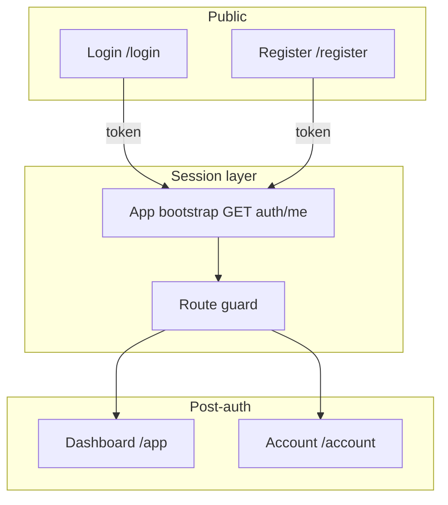
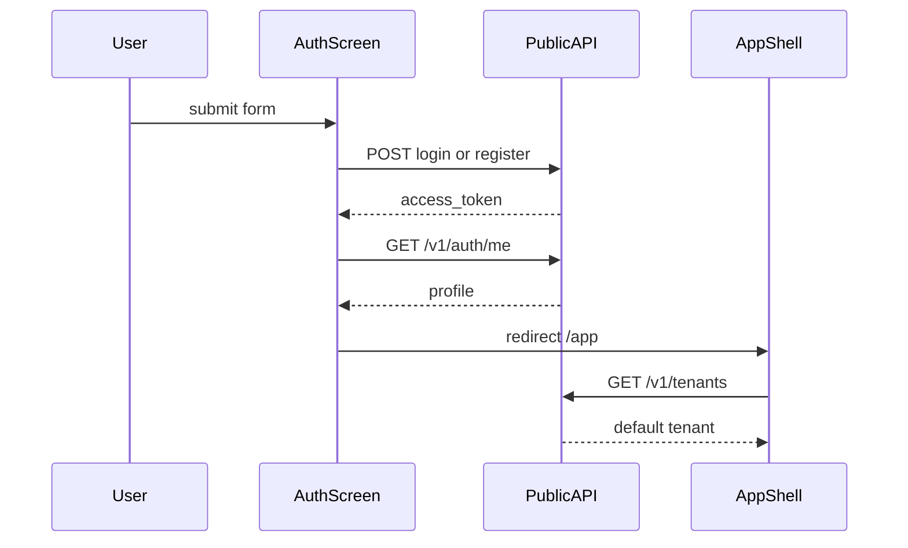

# Auth UI screens — Phase 1 design spec

Design-only specification for **Register**, **Login**, and the **session layer** on the general multi-tenant marketplace control-plane. No frontend implementation in this phase.

**Platform context:** [system-overview2.md](../architecture/system-overview2.md) — consumers and vendors on one plane; default **individual** org on signup.

---

## Screen inventory

| Screen | Route | API | Phase |
|--------|-------|-----|-------|
| Login | `/login` | `POST /v1/auth/login` | 1a |
| Register | `/register` | `POST /v1/auth/register` | 1a |
| Account / Profile | `/account` | `GET /v1/auth/me` | 1b (optional) |
| Session bootstrap | (none) | `GET /v1/auth/me` | invisible |

**Deliverable count:** 2 primary screens + 1 optional Account screen + invisible session layer.

See [session-flow.md](session-flow.md) for token storage, bootstrap, and 401 redirect.

---

## Layout pattern (all auth screens)

**Desktop (≥1024px):** Split layout — left 40% brand panel, right 60% centered form card (max 400px).

**Mobile (<1024px):** Single column — logo top, form below, no brand panel illustration.

Theme tokens: [theme-control-plane-neutral.md](theme-control-plane-neutral.md).

```
┌──────────────────────────────┬─────────────────────────────────────┐
│  BRAND PANEL (40%)           │  FORM COLUMN (60%)                  │
│  bg: #F8FAFC or subtle grad│                                     │
│                              │         ┌─────────────────┐         │
│  [Logo] Tenant Control Plane │         │  Form card      │         │
│                              │         │  max-width 400px│         │
│  Headline                    │         │  padding 24px   │         │
│  Sub copy                    │         │                 │         │
│                              │         │  Title          │         │
│                              │         │  Fields...      │         │
│                              │         │  [Primary CTA]  │         │
│                              │         │  Secondary link │         │
│                              │         └─────────────────┘         │
└──────────────────────────────┴─────────────────────────────────────┘
```

---

## Screen A — Login

**Route:** `/login`  
**API:** `POST /v1/auth/login`

### Copy

| Element | Text |
|---------|------|
| Title | Sign in to your workspace |
| Email label | Email |
| Password label | Password |
| Primary CTA | Sign in |
| Secondary | Don't have an account? **Create account** → `/register` |
| Error (401) | Invalid email or password |

### Wireframe — default

```
┌─────────────────────────────────┐
│  Sign in to your workspace      │
│                                 │
│  Email                          │
│  ┌───────────────────────────┐  │
│  │                           │  │
│  └───────────────────────────┘  │
│                                 │
│  Password              [Show]   │
│  ┌───────────────────────────┐  │
│  │ ••••••••                  │  │
│  └───────────────────────────┘  │
│                                 │
│  ┌───────────────────────────┐  │
│  │       Sign in             │  │
│  └───────────────────────────┘  │
│                                 │
│  Don't have an account?         │
│  Create account                 │
└─────────────────────────────────┘
```

### Wireframe — error

```
┌─────────────────────────────────┐
│  Sign in to your workspace      │
│                                 │
│  ┌─ Alert (error bg) ─────────┐ │
│  │ Invalid email or password  │ │
│  └────────────────────────────┘ │
│  ...fields unchanged...         │
└─────────────────────────────────┘
```

### Wireframe — loading

- Primary button disabled, label “Signing in…”
- Spinner 16px left of label
- Inputs disabled

### Success flow

1. Store `access_token`
2. `GET /v1/auth/me`
3. Redirect to `/app` (tenant home / dashboard)

---

## Screen B — Register

**Route:** `/register`  
**API:** `POST /v1/auth/register`

### Copy

| Element | Text |
|---------|------|
| Title | Create your account |
| Subcopy | You'll get an individual workspace by default. Upgrade to an organization later. |
| Display name label | Display name |
| Email label | Email |
| Password label | Password |
| Confirm password | Confirm password (UI-only) |
| Primary CTA | Create account |
| Secondary | Already have an account? **Sign in** → `/login` |
| Success toast | Your workspace is ready. |
| Error (400) | This email is already registered. **Sign in** instead. |

### Wireframe — default

```
┌─────────────────────────────────┐
│  Create your account            │
│  You'll get an individual       │
│  workspace by default...        │
│                                 │
│  Display name                   │
│  ┌───────────────────────────┐  │
│  │                           │  │
│  └───────────────────────────┘  │
│                                 │
│  Email                          │
│  ┌───────────────────────────┐  │
│  │                           │  │
│  └───────────────────────────┘  │
│                                 │
│  Password              [Show]   │
│  ┌───────────────────────────┐  │
│  │                           │  │
│  └───────────────────────────┘  │
│                                 │
│  Confirm password      [Show]   │
│  ┌───────────────────────────┐  │
│  │                           │  │
│  └───────────────────────────┘  │
│                                 │
│  ┌───────────────────────────┐  │
│  │     Create account        │  │
│  └───────────────────────────┘  │
│                                 │
│  Already have an account?       │
│  Sign in                        │
└─────────────────────────────────┘
```

### Wireframe — validation (client-side)

Inline errors below fields (red text, red border):

| Field | Rule | Message |
|-------|------|---------|
| Email | Invalid format | Enter a valid email address |
| Password | Min 8 chars | Password must be at least 8 characters |
| Confirm | Must match | Passwords do not match |
| Display name | Required | Display name is required |

### Wireframe — API error (400)

```
┌─ Alert (error) ─────────────────────────────┐
│ This email is already registered. Sign in.  │
└─────────────────────────────────────────────┘
```

### Success flow

Same as login: token → `/me` → `/app` + toast “Your workspace is ready.”

Backend creates **individual org + default tenant** on register ([tenant-domain.md](../domains/tenant-domain.md)).

---

## Screen C — Account / Profile (optional Phase 1b)

**Route:** `/account`  
**API:** `GET /v1/auth/me` (read-only Phase 1)

### Wireframe

```
┌─────────────────────────────────────────────────────────┐
│  Account                                                │
│                                                         │
│  ┌───────────────────────────────────────────────────┐  │
│  │  Profile                                          │  │
│  │                                                   │  │
│  │  Email          neha@example.com        (read)    │  │
│  │  Display name   Neha T                  (read)    │  │
│  │  Status         active                  (badge)   │  │
│  │                                                   │  │
│  │  [ Edit display name ]  (disabled / future )     │  │
│  │  [ Log out ]                                      │  │
│  └───────────────────────────────────────────────────┘  │
└─────────────────────────────────────────────────────────┘
```

**Not on this screen (Phase 2+):** password change, org upgrade, MFA.

---

## End-to-end user flow





**Post-auth landing (Phase 1):** Dashboard with welcome `{display_name}`, default tenant from `GET /v1/tenants`, shortcuts to Marketplace and Resources (future nav).

---

## API ↔ UI mapping

| UI action | Method | Path | Request body | Response used |
|-----------|--------|------|--------------|---------------|
| Register submit | POST | `/v1/auth/register` | `{ email, password, display_name }` | `access_token` |
| Login submit | POST | `/v1/auth/login` | `{ email, password }` | `access_token` |
| After auth | GET | `/v1/auth/me` | Header: `Authorization: Bearer {token}` | `id`, `email`, `display_name`, `status` |
| Dashboard bootstrap | GET | `/v1/tenants` | Bearer | Default tenant list |

### Client-side validation (match API)

| Field | Rule |
|-------|------|
| Email | Valid format (avoid 422) |
| Password | Min 8 characters (UI policy; recommend even if API allows shorter) |
| Display name | Required on register |
| Confirm password | Must equal password (UI only) |

### HTTP status → UI

| Status | Screen | UI |
|--------|--------|-----|
| 200 + token | Login/Register | Success flow |
| 401 | Login | Invalid email or password |
| 400 | Register | Email already registered |
| 422 | Register | Inline validation (email format) |
| 401 | `/me` | Clear token, redirect Login |

---

## Figma deliverables checklist

Create Figma page **“Auth — Phase 1”** with frames:

| Frame | States |
|-------|--------|
| Login — default | Empty form |
| Login — error | Invalid credentials alert |
| Login — loading | Disabled + spinner |
| Register — default | Empty form |
| Register — validation | Inline field errors |
| Register — error | Email taken alert |
| Account — profile | Data from `/me` |
| Components | Button, Input, Form card, Alert, Logo header |
| Redlines | 24px card padding, 16px field gap, 32px section gap |

Import colors and components from [theme-control-plane-neutral.md](theme-control-plane-neutral.md).

---

## Out of scope (Phase 1 auth)

- Keycloak SSO buttons
- “Become a vendor” on register
- Organization upgrade form
- MFA, password reset, email verification (Phase 2)
- Embedded Swagger / API testing UI

---

## Phased delivery

| Phase | Deliverable |
|-------|-------------|
| **1a** | Login + Register wireframes, theme tokens, API mapping (this doc) |
| **1b** | Account wireframe, session flow doc |
| **2** | App shell (header from `/me`, logout, tenant switcher) |
| **3** | Org upgrade, SSO, password reset |

---

## Success criteria (design complete)

- [x] Two wireframe specs: Login, Register (default, error, loading/validation)
- [x] Decision documented: `/me` = session + profile, not third auth screen
- [x] Theme token sheet: [theme-control-plane-neutral.md](theme-control-plane-neutral.md)
- [x] Flow diagram: register/login → token → me → tenants → dashboard
- [x] Copy aligned with individual-default org model

---

## Related

- [session-flow.md](session-flow.md)
- [theme-control-plane-neutral.md](theme-control-plane-neutral.md)
- [authentication-flow.md](../workflows/authentication-flow.md)
- [identity-domain.md](../domains/identity-domain.md)
