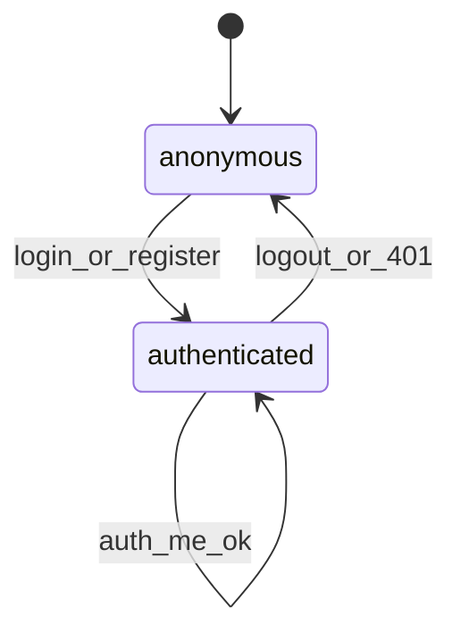
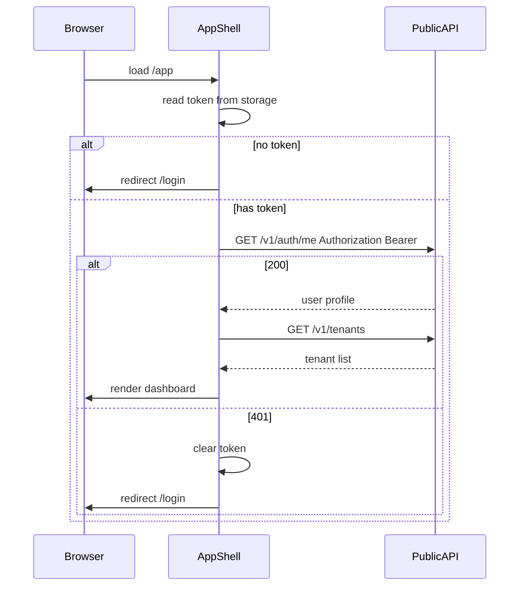

# Session flow — token storage and `/v1/auth/me`

`GET /v1/auth/me` is **not** a dedicated auth screen. It is the **session bootstrap** API used after login/register and on every app load.

---

## Decision summary

| API | UI role | Screen? |
|-----|---------|---------|
| `POST /v1/auth/register` | Create account | **Register** screen |
| `POST /v1/auth/login` | Sign in | **Login** screen |
| `GET /v1/auth/me` | Who is logged in? | **No** — session layer + optional **Account** screen |

---

## Token lifecycle

| Event | Action |
|-------|--------|
| Login/register success | Store `access_token` from response |
| App mount (protected routes) | `GET /v1/auth/me` with Bearer token |
| `/me` returns 200 | Set user context; allow app shell |
| `/me` returns 401 | Clear token; redirect to `/login` |
| Logout (user action) | Clear token; redirect to `/login` |
| Token expired | Same as 401 |

---

## Storage recommendation

| Option | Pros | Cons |
|--------|------|------|
| `sessionStorage` | Cleared when tab closes | Lost on new tab |
| `localStorage` | Persists across sessions | XSS exposure if site compromised |

**Phase 1 recommendation:** `sessionStorage` key `tenant_cp_access_token` for dev/MVP; move to httpOnly cookie + refresh token in production.

---

## Bootstrap sequence (app shell)

---

## Route guard rules

| Route | Rule |
|-------|------|
| `/login`, `/register` | Public; if token valid + `/me` ok → redirect `/app` |
| `/app`, `/account`, `/tenants/*` | Require token + successful `/me` |
| `/` | Redirect to `/app` if authenticated, else `/login` |

---

## Header chrome (uses `/me` data)

After bootstrap, cache user in app context:

| Field from `/me` | UI use |
|------------------|--------|
| `display_name` | Avatar initials, header greeting |
| `email` | Account screen, tooltip |
| `status` | Badge if not `active` (future) |
| `id` | Correlation for support (hidden by default) |

---

## Logout

1. Clear `tenant_cp_access_token` from storage.
2. Clear in-memory user/tenant context.
3. Navigate to `/login`.
4. Optional: call server revoke endpoint (future).

---

## Error handling

| API response | UI behavior |
|--------------|-------------|
| Register 422 | Inline email validation message |
| Register 400 “Email already registered” | Alert + link to Login |
| Login 401 | Generic “Invalid email or password” |
| `/me` 401 | Clear session, redirect Login |
| Network error | Retry banner on form |

---

## Related

- [auth-screens.md](auth-screens.md) — wireframes and API mapping
- [authentication-flow.md](../workflows/authentication-flow.md) — domain workflow
- Backend: [`src/identity/interfaces/api.py`](../../src/identity/interfaces/api.py)
