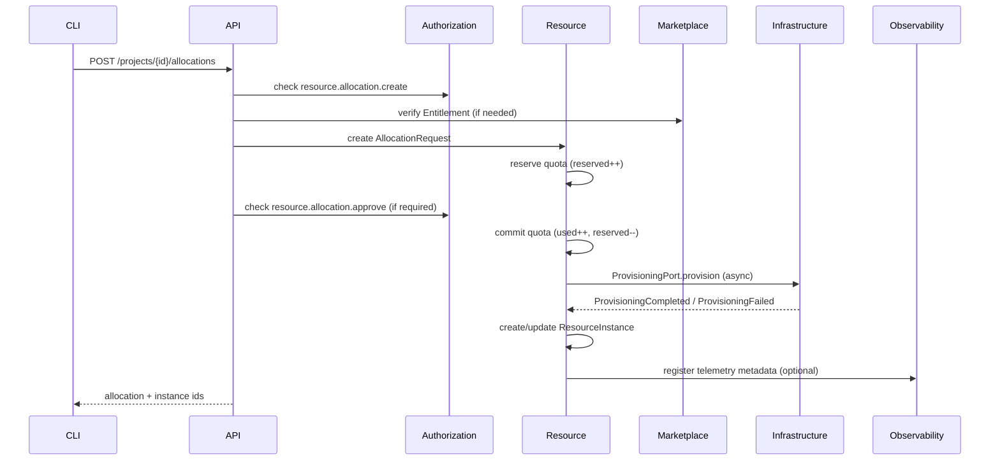

# Diagram: Allocation sequence (Phase 1)

## Notes

- Marketplace entitlement check is conditional on `resource_type_code` being gated by an offering.
- Provisioning is asynchronous; Phase 1 models the port/adapter but does not ship Kubernetes manifests.
- Every state transition should emit an audit entry and a domain event (via outbox).

