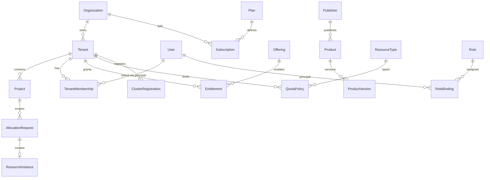

# Diagram: ER model (suggested, Phase 1)

This is a **modeling reference** to guide the initial PostgreSQL schema. It is intentionally technology-agnostic but maps cleanly to relational tables.

## Global vs tenant-scoped tables

### Global (shared, no `tenant_id`)

- `catalog.resource_types`
- `catalog.permissions`
- `catalog.plans` (templates)

### Tenant-scoped (RLS; include `tenant_id`)

- Tenant: `tenant.tenants`, `tenant.projects`, `tenant.memberships`, `tenant.onboarding_requests`
- AuthZ: `authz.roles`, `authz.role_bindings`, `authz.relationship_tuples`
- Resource: `resource.quota_policies`, `resource.quota_usage`, `resource.allocation_requests`, `resource.instances`
- Marketplace: `marketplace.entitlements` (catalog stays global)
- Billing: `billing.subscriptions`, `billing.usage_records`
- Infra: `infra.cluster_registrations`, `infra.provisioning_jobs`
- Observability: `observability.alert_rules`, `observability.tenant_config`

