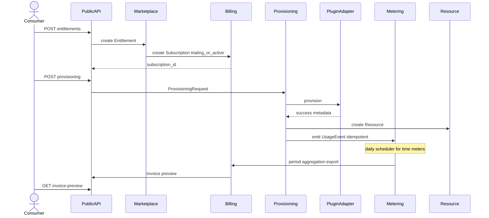

# Diagram: Marketplace commercial flow (subscription + usage)

Sequence for install → provision → meter → rate.

## Sequence

## Data touched

| Step | Tables / entities |
|------|-------------------|
| Install | `entitlements`, `subscriptions` |
| Provision | `provisioning_requests`, `resources` |
| Meter | `usage_events` |
| Bill | `usage_aggregations`, `invoice_preview` |

## Commercial states

Entitlement and subscription align on install and revoke. See billing domain state diagram in [billing-domain.md](../domains/billing-domain.md).

## Related

- [marketplace-tenant-lifecycle.md](../workflows/marketplace-tenant-lifecycle.md)
- [vendor-plugin-e2e-acme-metrics.md](../workflows/vendor-plugin-e2e-acme-metrics.md)
