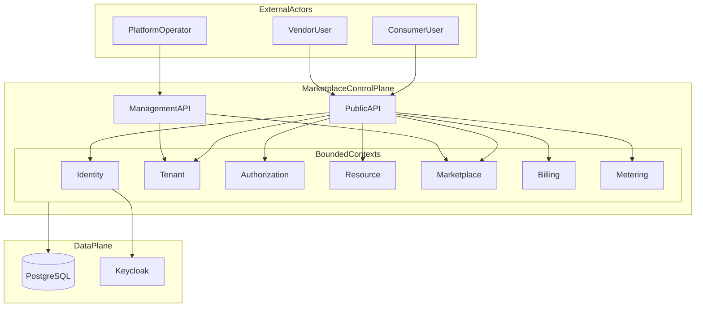

# Diagram: Marketplace platform context (C4)

System context for the general multi-tenant marketplace control-plane.

## Context diagram

## Container notes

| Container | Responsibility |
|-----------|----------------|
| Public API | Tenant-scoped customer + vendor routes |
| Management API | Platform RBAC only; private network |
| PostgreSQL | System of record |
| Keycloak | Authentication realms |

## Trust boundaries

- Public ingress never routes to Admin API.
- `platform.*` permissions evaluated only on management plane.
- Plugin adapters (stub → HTTP/gRPC) run behind platform dispatch.

## Related

- [marketplace-platform-master.md](../architecture/marketplace-platform-master.md)
- [system-overview.md](../architecture/system-overview.md)
