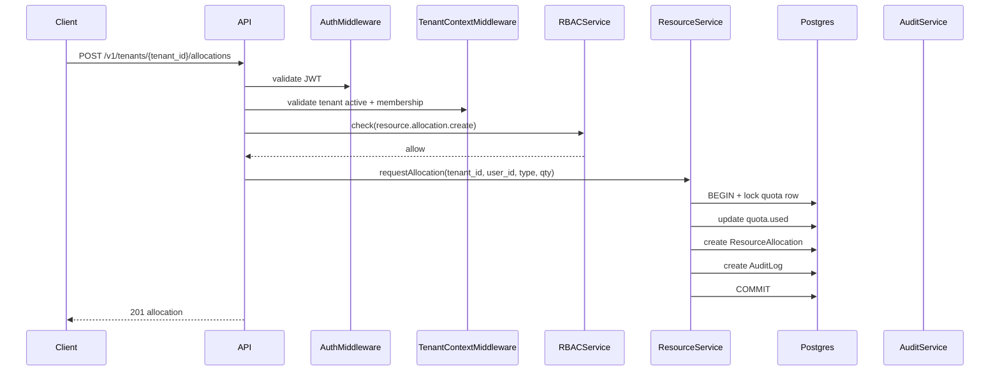

# Phase 2 allocation sequence (minimal foundation)

```mermaid
sequenceDiagram
  participant Client as Client
  participant API as API
  participant Auth as AuthMiddleware
  participant TCtx as TenantContextMiddleware
  participant RBAC as RBACService
  participant Res as ResourceService
  participant DB as Postgres
  participant Aud as AuditService

  Client->>API: POST /v1/tenants/{tenant_id}/allocations
  API->>Auth: validate JWT
  API->>TCtx: validate tenant active + membership
  API->>RBAC: check(resource.allocation.create)
  RBAC-->>API: allow
  API->>Res: requestAllocation(tenant_id, user_id, type, qty)
  Res->>DB: BEGIN + lock quota row
  Res->>DB: update quota.used
  Res->>DB: create ResourceAllocation
  Res->>DB: create AuditLog
  Res->>DB: COMMIT
  API-->>Client: 201 allocation
```

