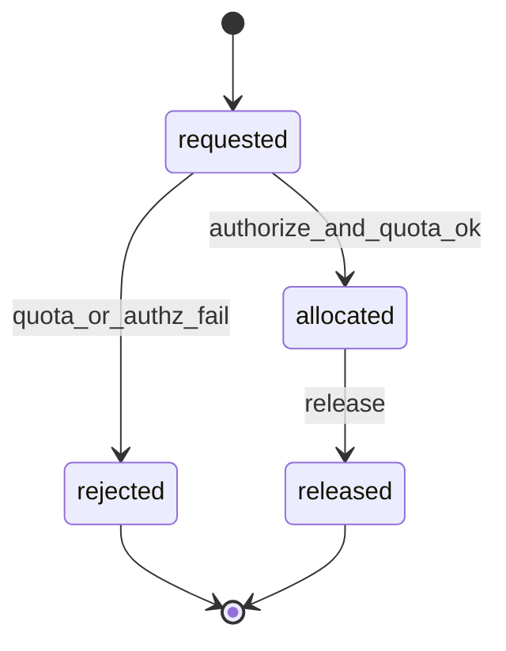

# Phase 2 allocation state machine (minimal foundation)

## Extension points (later)

- Add `pending_approval` and `approved` for human approval flows.
- Add `failed` if provisioning (Kubernetes/cloud) is introduced.

