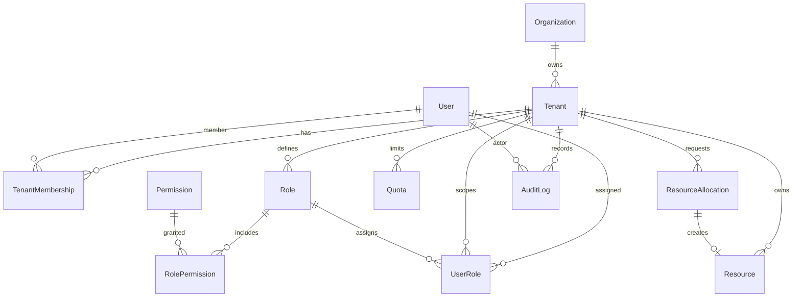

# Phase 2 ER diagram (minimal foundation)

## Notes for implementation planning

- `User` is global (no `tenant_id`) because a user can belong to multiple tenants.
- `Permission` is global catalog; `Role` is tenant-scoped.
- `AuditLog.tenant_id` is nullable for global actions; most entries will be tenant-scoped.

