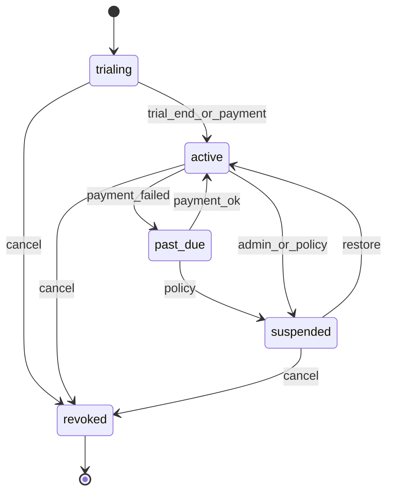

# Billing domain (bounded context: `billing`)

Commercial relationship between tenants and marketplace offerings: **subscription + usage** (base plan + metered overage).

## Responsibility

- Define **plans** (pricing templates)
- Manage **subscriptions** linked to entitlements
- Ingest **usage** from Metering domain for rating and invoicing
- Produce **invoice previews** (payment processor deferred)

## Boundary

Owns:

- `Plan`, `PlanPricingDimension`, `Subscription`, `InvoicePreview` (read model)

Does not own:

- Plugin provisioning (Marketplace)
- Raw usage collection (Metering) — Billing consumes `UsageEvent`
- Payment capture (Stripe, etc.) — future integration

## Core entities

### `Plan`

| Aspect | Detail |
|--------|--------|
| **Purpose** | Reusable commercial template for offerings |
| **Attributes** | `id`, `code`, `name`, `billing_period` (`monthly` \| `annual`), `base_price_cents`, `currency`, `included_units_json`, `status` |
| **Example** | `acme-metrics-standard-monthly` — $99/mo + 1M samples included |

### `Subscription`

| Aspect | Detail |
|--------|--------|
| **Purpose** | Active commercial contract for a tenant + offering |
| **Attributes** | `id`, `tenant_id`, `entitlement_id`, `plan_id`, `status`, `current_period_start`, `current_period_end` |
| **Relationships** | N:1 Plan; 1:1 Entitlement (typical) |
| **Lifecycle** | `trialing` → `active` → `past_due` → `suspended` → `revoked` |

### `InvoicePreview` (read model)

| Aspect | Detail |
|--------|--------|
| **Purpose** | Estimated charges for a billing period |
| **Attributes** | `tenant_id`, `period_start`, `period_end`, `line_items_json`, `total_cents` |
| **Sources** | Plan base fee + rated usage from Metering aggregations |

## Integration with Marketplace

| Marketplace entity | Billing link |
|--------------------|--------------|
| `MarketplaceOffering` | `plan_id` (FK) |
| `Entitlement` | creates/updates `Subscription` on install |
| Install with trial | `Subscription.status = trialing` |

## Rating flow (conceptual)

1. Metering emits `UsageEvent` rows.
2. Billing job aggregates by `(tenant_id, meter_code, period)`.
3. Apply plan included units; compute overage per `PlanPricingDimension`.
4. Append line items to `InvoicePreview`.

## Security and audit

- Tenant-scoped reads for tenant admins (`billing.read` future permission).
- Platform operators may view cross-tenant for support (`platform.billing.read`).
- Audit: subscription created, status changes, invoice generated.

## Related

- [metering-domain.md](metering-domain.md)
- [vendor-plugin-domain.md](vendor-plugin-domain.md)
- [marketplace-platform-master.md](../architecture/marketplace-platform-master.md)
