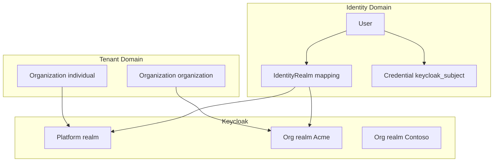
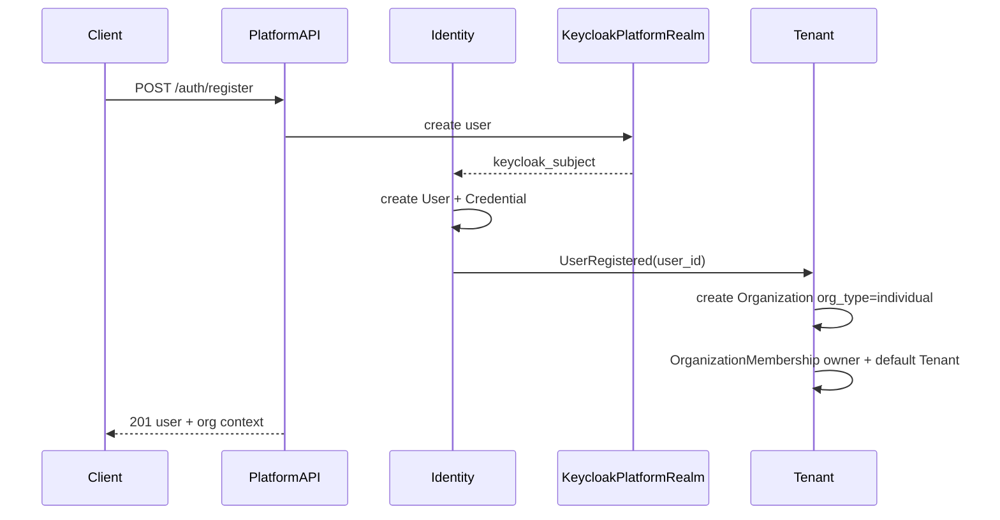
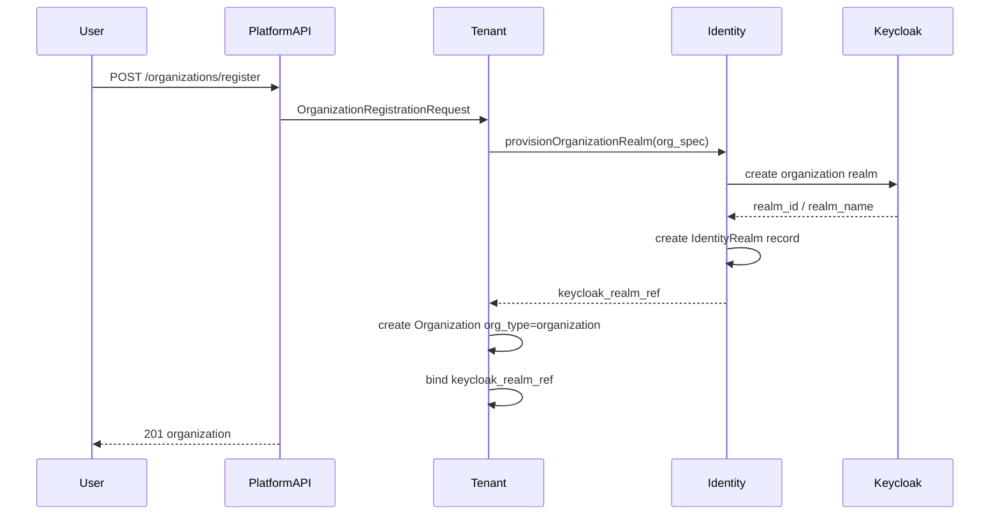
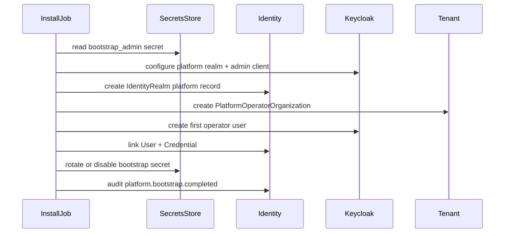

# Identity domain (bounded context: `identity`)

This domain establishes **who** is interacting with the platform and **where they authenticate**, aligned with the [system overview](../architecture/system-overview.md):

- All users authenticate through **Keycloak**
- **Individual** organizations use the **platform Keycloak realm**
- **Organization**-type entities receive a **dedicated Keycloak org realm** during organization registration

## Business responsibility

The Identity domain manages:

- Human **users** (platform principals)
- **Keycloak integration** (platform realm + org realms)
- **Service accounts** and **API keys** (automation principals, tenant-scoped)
- Sessions/tokens and credential lifecycle
- Orchestration of **Keycloak org realm provisioning** (invoked by Tenant domain during organization registration)

## Bounded context boundary

Owns:

- Users, service accounts, credentials, sessions, API keys
- Keycloak realm registry and provisioning orchestration (`IdentityRealm` / realm mapping)
- Mapping between platform `user_id` and Keycloak `subject` per realm

Does not own:

- Organization business record (`org_type`, `participation`, billing)—Tenant domain stores org and holds `keycloak_realm_ref`
- Tenant/organization membership rules—Tenant domain
- RBAC permissions—Authorization domain
- Vendor profile—Vendor/Plugin domain

---

## Keycloak topology

| Realm | Used by | Created when | Stored on |
|-------|---------|--------------|-----------|
| **Platform realm** | All users; individual orgs (`org_type = individual`) | Platform deployment | Identity config |
| **Organization realm** | Customer org-type organizations (`org_type = organization`) | Organization registration journey | `Organization.keycloak_realm_ref` (Tenant domain) |
| **Operator client / realm** | Platform Operator org members (admin API) | Platform deployment or operator org realm | Separate Keycloak client; not valid on public API routes |

### Authentication paths

| User context | Login realm | JWT notes |
|--------------|-------------|-----------|
| Individual consumer/vendor | Platform realm | `sub` = Keycloak subject; map to platform `user_id` |
| Organization member | Organization realm (or brokered from platform—integration choice) | Include org context claims agreed with Authorization |
| Service account / API key | Platform-issued or tenant-scoped keys | No Keycloak session; separate auth path |

**Principle:** Do not embed RBAC roles in JWT; resolve permissions per request.

### Platform operator authentication (management plane)

| Aspect | Customer (public API) | Platform operator (admin API) |
|--------|----------------------|------------------------------|
| Ingress | Public hostname | Private / VPN / zero-trust only |
| Keycloak client | `platform-public-client` (example) | `platform-admin-client` (example) |
| Token audience | Public API resource | Admin API resource only |
| Permissions in token | None (resolved in DB) | None; `platform.*` resolved in DB |
| Membership | Tenant + customer org | `PlatformOperatorOrganization` only |

Customer JWTs must **not** be accepted by the Admin API even if misconfigured RBAC rows exist.

---

## Aggregates and entities

| Aggregate | Contains / purpose |
|-----------|-------------------|
| **`User`** | Human principal; links to Keycloak subject(s) |
| **`IdentityRealm`** | Registry of Keycloak realms (platform + org realms) |
| **`Credential`** | Password/federated link; stores `keycloak_subject`, realm reference |
| **`ServiceAccount`** | Automation principal; tenant-scoped |
| **`Session`** | User session / refresh token metadata |
| **`ApiKey`** | Child of ServiceAccount |

---

## Entity specifications

### `User`

| Aspect | Detail |
|--------|--------|
| **Definition** | Human principal registered on the platform |
| **Business purpose** | Authenticate, attribute actions, link to default individual org (Tenant) |
| **Real-world examples** | `alice@example.com` |
| **Attributes** | `id`, `email` (unique), `display_name`, `status`, `primary_keycloak_subject`, `primary_realm_ref`, timestamps |
| **Relationships** | User 1:N Credential; User 1:N Session; User N:M Organization (Tenant); User N:M Tenant via TenantMembership |
| **Lifecycle** | `pending_verification → active → locked → deactivated` |
| **On registration** | Created in platform Keycloak realm; Tenant creates default individual `Organization` |
| **Security** | Brute-force protection; MFA via Keycloak (Phase 2+) |
| **Audit** | register, verify, lock, login |

### `IdentityRealm`

| Aspect | Detail |
|--------|--------|
| **Definition** | Registry entry for a Keycloak realm used by the platform |
| **Business purpose** | Track realm metadata for login routing and org realm lifecycle |
| **Attributes** | `id`, `realm_name`, `realm_type` (`platform` \| `organization`), `keycloak_realm_id`, `organization_id?`, `status` (`active` \| `suspended` \| `deprovisioned`), `created_at` |
| **Relationships** | 0..1 Organization (for org realms); 1:N Credentials (users linked in that realm) |
| **Lifecycle** | Org realms: `provisioning → active → suspended → deprovisioned` |
| **Provisioning** | `provisionOrganizationRealm(org_spec)` called by Tenant during `OrganizationRegistrationRequest` |
| **Audit** | realm_created, realm_suspended, realm_deprovisioned |

### `Credential`

| Aspect | Detail |
|--------|--------|
| **Definition** | Authentication binding between platform user and Keycloak identity |
| **Business purpose** | Support platform realm login and optional org-realm identities |
| **Attributes** | `id`, `user_id`, `identity_realm_id`, `keycloak_subject`, `type` (`password` \| `federated`), `status`, timestamps |
| **Note** | Password verification may be delegated entirely to Keycloak; platform stores subject mapping, not password hash, when Keycloak is source of truth |
| **Security** | Never duplicate secrets if Keycloak owns credentials |
| **Audit** | created, linked, removed |

### `ServiceAccount`

| Aspect | Detail |
|--------|--------|
| **Definition** | Non-human principal for automation (CLI/CI) |
| **Attributes** | `id`, `tenant_id`, `organization_id`, `name`, `description`, `status`, `created_by_user_id`, timestamps |
| **Relationships** | ServiceAccount 1:N ApiKey; scoped to tenant + owning org |
| **Lifecycle** | `active → revoked` |
| **Security** | API keys hashed; tenant-bound at auth time |
| **Audit** | create, revoke, key lifecycle |

### `ApiKey` (entity under ServiceAccount)

| Attributes | `id`, `service_account_id`, `prefix`, `key_hash`, `scopes[]`, `expires_at?`, `last_used_at?`, `status` |
| **Security** | Show once; constant-time verify |

### `Session`

| Aspect | Detail |
|--------|--------|
| **Definition** | Server-side session tied to Keycloak token exchange or platform session |
| **Attributes** | `id`, `user_id`, `identity_realm_id`, `keycloak_session_id?`, `refresh_token_hash?`, `expires_at`, `revoked_at?`, `client_id`, `ip`, `user_agent`, `status` |
| **Lifecycle** | `active → revoked \| expired` |

---

## Workflows

### User registration (with default individual organization)

| Step | Identity | Tenant |
|------|----------|--------|
| 1 | Create user in **platform Keycloak realm** | — |
| 2 | Persist `User`, `Credential` (`keycloak_subject`) | — |
| 3 | Emit `UserRegistered` | Create individual org, membership, default tenant |
| 4 | Audit login identity created | Audit org created |

### Organization registration (Keycloak org realm)

| Step | Identity | Tenant |
|------|----------|--------|
| 1 | — | Validate org registration request |
| 2 | Create Keycloak **org realm**; persist `IdentityRealm` | — |
| 3 | Return `keycloak_realm_ref` | Create `Organization`, set `org_type = organization` |
| 4 | Configure realm clients, optional member invites | Seed org tenant, org-admin membership |
| 5 | Audit `keycloak.realm.created` | Audit `organization.registered` |

### Vendor participation (identity implications)

Vendor registration does **not** create a new realm:

| Vendor type | Auth realm | Identity action |
|-------------|------------|-----------------|
| Individual vendor | Platform realm | No new realm; user already in platform realm |
| Organization vendor | Org realm | Org members authenticate via org `IdentityRealm` |

Identity ensures tokens presented for vendor APIs resolve to the correct `user_id` and realm; Authorization + Tenant enforce org/tenant scope.

### Platform bootstrap (install-time identity)

| Actor | Lifecycle | Notes |
|-------|-----------|-------|
| `bootstrap-admin` | Ephemeral | Management network only; used only during install job |
| First human operator | Steady state | Invited to Platform Operator org; MFA required |
| break-glass | Emergency | Dual-control; separate credential in sealed secrets |

**Rules:**

- Bootstrap password never committed to git; load from secrets store at install.
- After bootstrap, disable bootstrap login or rotate credentials immediately.
- Operator users are normal `User` rows with membership in `is_platform_operator = true` org.

See [management plane](../architecture/management-plane.md).

---

## JWT claims (minimal, realm-aware)

| Claim | Purpose |
|-------|---------|
| `sub` | Keycloak subject (map to `user_id` via Credential) |
| `iss` | Issuer / realm identifier |
| `exp`, `iat` | Token lifetime |
| `sid` | Session id (optional) |

Optional custom claims (avoid role explosion):

- `org_id` — active organization context (when applicable)
- `realm_type` — `platform` \| `organization`

Do **not** embed permission lists in JWT.

---

## Security considerations

| Risk | Mitigation |
|------|------------|
| Cross-realm identity confusion | Always resolve `(identity_realm_id, keycloak_subject)` → `user_id` |
| Org realm sprawl | Tie org realm lifecycle to `Organization` status; deprovision on close |
| Token from wrong realm | Validate `iss` matches expected realm for route/tenant context |
| Service account scope creep | Bind API keys to `tenant_id` + `organization_id` |

---

## Audit requirements

- User registration, verification, lock/unlock
- Keycloak org realm created, suspended, deprovisioned
- Credential linked/unlinked
- Service account and API key lifecycle
- Login success/failure (rate-limited)
- Platform bootstrap completed; bootstrap credential rotated/disabled
- Operator admin client logins (management plane)
- break-glass usage (every action, alerting)

---

## Related documentation

- [System overview](../architecture/system-overview.md) — platform vision, org types, vendor paths
- [Management plane](../architecture/management-plane.md) — public vs admin API, VPN, bootstrap
- [Tenant domain](tenant-domain.md) — Organization, Platform Operator org, registration journeys
- [Authorization domain](authorization-domain.md) — `platform.*` permissions
- [Vendor plugin domain](vendor-plugin-domain.md) — vendor profile after participation opt-in
