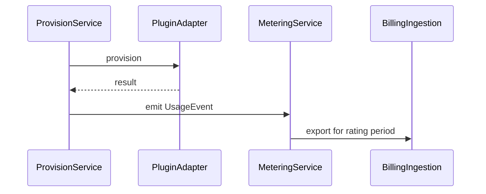

# Metering domain (bounded context: `metering`)

Collects **usage signals** for marketplace offerings: append-only events, periodic aggregation, export to Billing for rating.

## Responsibility

- Register **meters** (catalog) declared by plugins/offerings
- Record **usage events** (immutable, idempotent)
- **Aggregate** usage for billing periods and operational dashboards

## Boundary

Owns:

- `Meter`, `UsageEvent`, `UsageAggregation`

Does not own:

- Pricing, invoices, payment (Billing)
- Provisioning execution (Marketplace adapter)

## Meter registration

Meters are declared in:

- **Plugin capability manifest** (vendor submits with `PluginVersion`), and/or
- **`MarketplaceOffering.meter_codes[]`** (commercial binding)

### `Meter`

| Attribute | Description |
|-----------|-------------|
| `code` | Unique stable id, e.g. `acme.metrics.ingested_samples` |
| `display_name` | Human label |
| `granularity` | `resource_instance` \| `operation` \| `time` |
| `unit` | `count`, `hour`, `gb`, etc. |
| `plugin_version_id?` | Optional source plugin version |

## Usage event model

### `UsageEvent` (append-only)

| Attribute | Description |
|-----------|-------------|
| `id` | PK |
| `tenant_id` | Required |
| `offering_id` | Commercial context |
| `entitlement_id?` | Install context |
| `resource_id?` | For per-instance meters |
| `meter_code` | FK to meter catalog |
| `quantity` | Numeric usage amount |
| `occurred_at` | Event timestamp |
| `idempotency_key` | Dedup key |
| `source` | `plugin_adapter` \| `platform_scheduler` \| `platform_api` |

### Emission points

| Trigger | Granularity | Example |
|---------|-------------|---------|
| Provisioning success | operation + resource_instance | One event on `metrics.export.provision` |
| Periodic scheduler | time | `active_integration_hours` per day |
| High-volume adapter callback | usage | `ingested_samples` batch |

### `UsageAggregation`

| Attribute | Description |
|-----------|-------------|
| `tenant_id`, `meter_code`, `period_start`, `period_end` | Key |
| `total_quantity` | Sum of events in window |
| `event_count` | Diagnostics |

## Idempotency and integrity

- Same `idempotency_key` → no duplicate charge.
- Events are never updated; corrections use compensating events (negative quantity) in future.
- Tenant isolation: all queries require `tenant_id`.

## Security

- Plugins emit via platform only (adapter returns usage hints; platform writes events).
- Tenants read own usage summaries; vendors see aggregated usage for their offerings (policy-limited).

## Related

- [billing-domain.md](billing-domain.md)
- [vendor-plugin-domain.md](vendor-plugin-domain.md) — offering metering section
