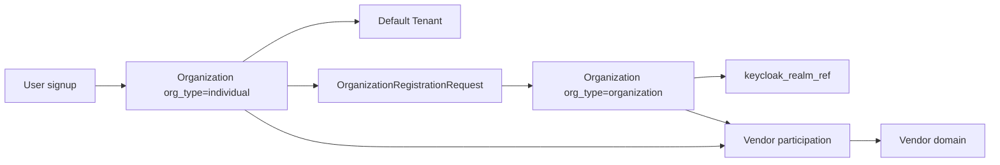

# Tenant domain (bounded context: `tenant`)

This domain implements the **tenant control-plane hierarchy** described in the [system overview](../architecture/system-overview.md): every user gets a default **Individual** organization, may upgrade to an **Organization** (with a Keycloak org realm), and may participate as a **vendor** linked to their owning organization.

## Business responsibility

The Tenant domain defines the **entity hierarchy** and the **primary isolation boundary** for the platform:

- Establish `Organization → Tenant → Project`
- Model **organization type** (`individual` | `organization`) and **participation** (`consumer` | `vendor` | `consumer_and_vendor`)
- Orchestrate **user registration** (default individual org), **organization registration** (upgrade + realm binding), and **tenant onboarding**
- Manage membership (who belongs) separately from permission grants (Authorization domain)
- Own tenant lifecycle states: active, suspended, deleted

## Bounded context boundary

Owns:

- Organizations (including `org_type`, `participation`, Keycloak realm **reference**)
- Tenants, projects
- Organization membership and tenant membership
- Onboarding and organization-registration workflow state

Does not own:

- Keycloak realm provisioning execution (Identity domain orchestrates; Tenant stores `keycloak_realm_ref`)
- Authentication credentials/sessions (Identity)
- Vendor catalog, plugins, offerings (Vendor/Plugin domain)—only the link `organization_id → vendor_id?`
- Permissions, role bindings (Authorization)
- Quotas, allocations (Resource)
- Commercial states (Billing), except references/IDs

## Core concepts (aligned with platform model)

| Concept | Values | Owned here | Notes |
|---------|--------|------------|-------|
| `org_type` | `individual` \| `organization` | `Organization` | Default on signup is `individual` |
| `participation` | `consumer` \| `vendor` \| `consumer_and_vendor` | `Organization` | Vendor opt-in updates participation |
| `keycloak_realm_ref` | external id / realm name | `Organization` | Set when `org_type = organization`; null for individual |
| Tenant | isolation boundary | `Tenant` | Consumer workloads and entitlements live here |
| Vendor link | optional FK | `Organization.vendor_id?` | Vendor aggregate lives in Vendor/Plugin domain |
| `is_platform_operator` | `true` \| `false` | `Organization` | Marks org that operates the SaaS (not a customer) |

### Platform Operator organization

The **entity responsible for managing the SaaS** is an `Organization` with `is_platform_operator = true`. It uses the same `org_type` model as customers:

| Operator entity | `org_type` | Example |
|-----------------|------------|---------|
| Solo platform owner | `individual` | Founder / early-stage operator |
| Platform ops company | `organization` | “Acme Cloud Ops” with operator Keycloak org realm |

| Property | Rule |
|----------|------|
| Count per deployment | Typically **one** (or very few) Platform Operator orgs |
| Customer overlap | Customer orgs have `is_platform_operator = false` |
| Tenants | Operator org may have zero customer tenants; not used for marketplace consumption |
| Authorization | Members get **platform-scoped** roles (`platform.*`) on [management plane](../architecture/management-plane.md) only |
| Bootstrap | Created during install job before any customer registers |

See [management plane](../architecture/management-plane.md) for network isolation (VPN / zero-trust) and bootstrap workflow.

---

## Aggregates and entities

### Aggregates

| Aggregate | Invariant |
|-----------|-----------|
| **`Organization`** | Every user has at least one org; `org_type = organization` requires `keycloak_realm_ref` when active |
| **`Tenant`** | Belongs to exactly one organization; primary data isolation boundary |
| **`Project`** | Belongs to exactly one tenant; slug unique per tenant |
| **`OrganizationMembership`** | Links user to organization (org-level governance, distinct from tenant membership) |
| **`TenantMembership`** | Links principal to tenant; membership role ≠ RBAC role |
| **`OrganizationRegistrationRequest`** | Idempotent org upgrade journey including Keycloak realm provisioning step |
| **`OnboardingRequest`** | Idempotent tenant/project creation within an organization |

---

## Entity specifications

### `Organization`

| Aspect | Detail |
|--------|--------|
| **Definition** | Top-level entity anchoring tenants, billing, governance, and optional vendor participation |
| **Business purpose** | Legal/logical boundary; distinguishes solo individuals from structured organizations |
| **Real-world examples** | “Jane Doe (individual)”, “Acme Corp (organization)” |
| **Attributes** | `id`, `name`, `slug`, `org_type`, `participation`, `is_platform_operator`, `keycloak_realm_ref?`, `vendor_id?`, `status`, `billing_account_ref?`, timestamps |
| **`org_type`** | `individual` (default) \| `organization` |
| **`participation`** | `consumer` (default) \| `vendor` \| `consumer_and_vendor` |
| **`keycloak_realm_ref`** | External Keycloak realm identifier; **required** when `org_type = organization` and status is `active` |
| **`vendor_id`** | Optional FK to Vendor aggregate (Vendor/Plugin domain) after vendor registration |
| **Relationships** | Organization 1:N Tenant; Organization 1:N OrganizationMembership; Organization 0..1 Vendor |
| **Cardinality** | User N:M Organization via OrganizationMembership; Organization 1:N Tenant |
| **Lifecycle** | `provisioning → active → suspended → closed` |
| **Ownership** | Tenant domain |
| **Security** | Org admins mutate org settings; individual org owner is the registering user |
| **Audit** | Create, org_type change, participation change, suspend, close, realm bound |
| **Scalability** | Indexed by `slug`, `(org_type, status)` |

#### Organization type rules

| `org_type` | Created when | Keycloak | Typical participation |
|------------|--------------|----------|------------------------|
| `individual` | User registration (automatic) | Platform realm only (`keycloak_realm_ref` null) | Consumer; may become individual vendor |
| `organization` | Organization registration journey | Dedicated org realm provisioned; ref stored on org | Consumer, org vendor, or both |

### `OrganizationMembership`

| Aspect | Detail |
|--------|--------|
| **Definition** | Link between a user and an organization at the **org governance** level |
| **Business purpose** | Org owners/admins for organization-type entities; owner of individual org on signup |
| **Attributes** | `id`, `organization_id`, `user_id`, `org_role` (`owner` \| `admin` \| `member`), `status` (`active` \| `removed`), timestamps |
| **Relationships** | Organization 1:N OrganizationMembership; User 1:N OrganizationMembership |
| **Note** | Distinct from `TenantMembership` and from RBAC `RoleBinding` |
| **Lifecycle** | active → removed |
| **Audit** | invite, join, role change, remove |

### `Tenant`

| Aspect | Detail |
|--------|--------|
| **Definition** | Primary isolation boundary for data, quotas, and marketplace entitlements |
| **Business purpose** | Partition workloads (e.g., prod vs dev) under an organization |
| **Real-world examples** | `jane-default`, `acme-prod`, `acme-dev` |
| **Attributes** | `id`, `organization_id`, `name`, `slug`, `isolation_tier`, `status`, `settings_json`, timestamps |
| **Relationships** | Tenant N:1 Organization; Tenant 1:N Project, TenantMembership, quotas, entitlements |
| **Lifecycle** | `pending → active → suspended → deleted` |
| **Ownership** | Tenant domain |
| **Security** | All tenant-scoped data carries `tenant_id`; RLS in later phases |
| **Audit** | Full lifecycle transitions |

### `Project`

| Aspect | Detail |
|--------|--------|
| **Definition** | Sub-scope inside a tenant for organizing resources |
| **Attributes** | `id`, `tenant_id`, `name`, `slug`, `labels`, `status`, timestamps |
| **Relationships** | Project N:1 Tenant; Project 1:N allocations (Resource) |
| **Lifecycle** | `active → archived → deleted` |
| **Ownership** | Tenant domain |

### `TenantMembership`

| Aspect | Detail |
|--------|--------|
| **Definition** | Link between a principal and a tenant |
| **Business purpose** | “Belongs to tenant” for API tenant context; not permission grants |
| **Attributes** | `id`, `tenant_id`, `principal_id`, `principal_type`, `membership_role`, `status`, timestamps |
| **Lifecycle** | `invited → active → removed` |
| **Ownership** | Tenant domain |

### `OrganizationRegistrationRequest`

| Aspect | Detail |
|--------|--------|
| **Definition** | Idempotent workflow upgrading or creating an `organization`-type org |
| **Business purpose** | Coordinate org creation + Keycloak org realm provisioning + default tenant seeding |
| **Real-world example** | User upgrades from individual to “Acme Corp” with dedicated realm |
| **Attributes** | `id`, `requested_by_user_id`, `source_organization_id?` (individual org being upgraded), `org_spec` (name, slug, contacts), `status`, `steps_completed[]`, `keycloak_realm_ref?`, `result_organization_id?`, `failure_reason?`, `idempotency_key` |
| **Lifecycle states** | `submitted → validating → provisioning_realm → provisioning_defaults → completed \| failed` |
| **Steps (conceptual)** | validate slug → call Identity to create Keycloak realm → create Organization → bind realm ref → seed tenant/project → assign org-admin roles → audit |
| **Ownership** | Tenant domain (orchestrates); Identity executes realm provisioning |
| **Audit** | submitted, realm_created, completed, failed |

### `OnboardingRequest`

| Aspect | Detail |
|--------|--------|
| **Definition** | Idempotent workflow creating tenant + project within an existing organization |
| **Attributes** | `id`, `organization_id`, `requested_by_principal_id`, `tenant_spec`, `status`, `steps_completed[]`, `idempotency_key` |
| **Lifecycle** | `submitted → validating → provisioning_defaults → completed \| failed` |
| **Ownership** | Tenant domain |

---

## Workflows

### 1) User registration (default individual organization)

| Step | Action | Domain |
|------|--------|--------|
| 1 | Create `User` (Identity) in **platform Keycloak realm** | Identity |
| 2 | Create `Organization` with `org_type = individual`, `participation = consumer` | Tenant |
| 3 | Create `OrganizationMembership` (user as `owner`) | Tenant |
| 4 | Seed default `Tenant` (+ optional `Project`) | Tenant |
| 5 | Seed consumer RBAC roles | Authorization |
| 6 | Audit `user.registered`, `organization.created` | Audit |

### 2) Organization registration (upgrade to `organization`)

| Step | Action | Domain |
|------|--------|--------|
| 1 | User submits `OrganizationRegistrationRequest` | Tenant |
| 2 | Validate slug, policies, contacts | Tenant |
| 3 | Identity provisions **Keycloak org realm** | Identity |
| 4 | Create or transition `Organization` (`org_type = organization`, store `keycloak_realm_ref`) | Tenant |
| 5 | Invite/link org members to org realm | Identity + Tenant |
| 6 | Seed org tenant(s), org-admin RBAC | Tenant + Authorization |
| 7 | Audit `organization.registered`, `keycloak.realm.created` | Audit |

### 3) Vendor participation (individual or organization)

| Step | Action | Domain |
|------|--------|--------|
| 1 | Org owner (or org admin) requests vendor participation | Tenant |
| 2 | Update `Organization.participation` → `vendor` or `consumer_and_vendor` | Tenant |
| 3 | Create/activate `Vendor` linked via `organization.vendor_id` | Vendor/Plugin |
| 4 | Assign vendor RBAC permissions | Authorization |
| 5 | Audit `vendor.activated` | Audit |

After vendor activation, publishing is **plugin-first**: `ServicePlugin` → approved `PluginVersion` → `Product` (bound to plugin) → `MarketplaceOffering`. Products cannot be listed without a backing plugin. See [vendor-plugin domain](vendor-plugin-domain.md).

### 4) Platform bootstrap (install-time)

| Step | Action | Domain |
|------|--------|--------|
| 1 | Install job runs on management network | Ops |
| 2 | Create `Organization` with `is_platform_operator = true`, `org_type` per install policy | Tenant |
| 3 | Create first operator `OrganizationMembership` (owner) | Tenant |
| 4 | Identity provisions operator user + Keycloak binding | Identity |
| 5 | Authorization seeds `platform.*` roles for operator org | Authorization |
| 6 | Rotate/disable bootstrap credentials; audit `platform.bootstrap.completed` | Audit |

---

## Relationship mappings

| From | To | Cardinality | Notes |
|------|-----|-------------|-------|
| User | Organization | N:M | via OrganizationMembership; default individual org on signup |
| Organization | Tenant | 1:N | consumer/vendor workloads |
| Organization | Vendor | 0..1 | optional after vendor registration |
| Organization | Keycloak realm | 0..1 | only when `org_type = organization` |
| Tenant | Project | 1:N | |
| User | Tenant | N:M | via TenantMembership |

---

## Ownership boundaries (integration points)

**Emits (via outbox / handlers):**

- `UserRegistered` → seed individual org + default tenant
- `OrganizationRegistered` → realm bound, org tenants ready
- `VendorParticipationActivated` → Vendor domain setup
- `TenantCreated`, `TenantSuspended`, `ProjectCreated`

**Consumes:**

- Identity: Keycloak realm provisioning result (`keycloak_realm_ref`)
- Authorization: default role bindings on org/tenant creation
- Resource: default quota seeding
- Billing (future): trial subscription on tenant creation

**Related documentation:**

- [System overview](../architecture/system-overview.md)
- [Management plane](../architecture/management-plane.md) — public vs admin API, bootstrap, VPN/zero-trust
- [Identity domain](identity-domain.md) — Keycloak realms and authentication
- [Authorization domain](authorization-domain.md) — platform-scoped RBAC
- [Vendor plugin domain](vendor-plugin-domain.md) — vendor catalog and provisioning
