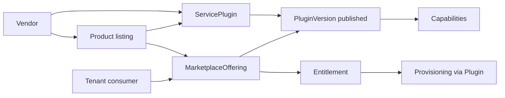
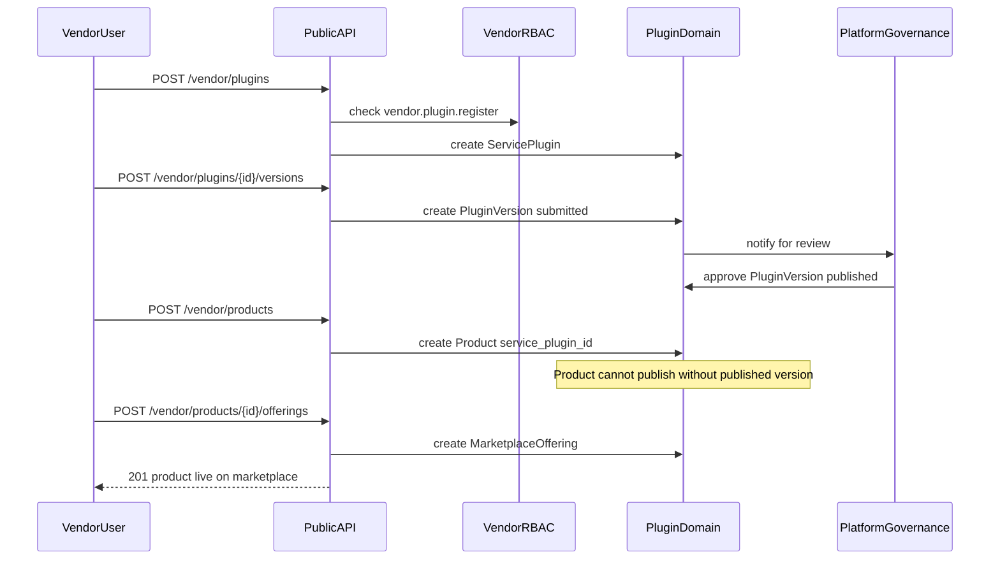
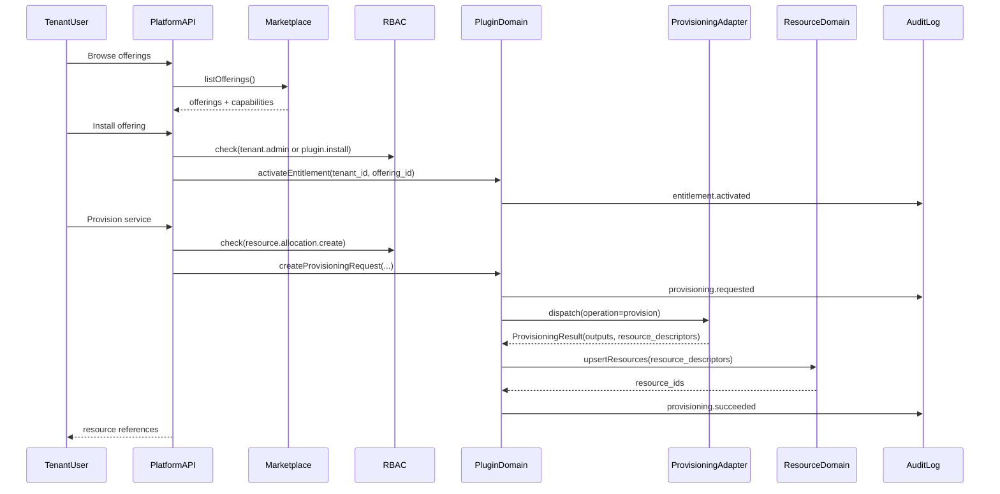

# Vendor service plugin domain (plugin-based marketplace + provisioning architecture)

This document defines an enterprise-grade **Vendor Service Plugin** architecture for a multi-tenant cloud platform. It is **architecture and domain modeling only** (no code, no production deployment, no Kubernetes manifests).

The goal is to enable a marketplace and provisioning layer similar conceptually to:

- AWS Marketplace integrations
- Terraform providers
- Kubernetes operators (CSI/CNI, controllers)
- GitHub Apps
- Datadog integrations
- OpenAI provider integrations

> **Platform alignment:** Vendors are linked to an [Organization](tenant-domain.md) after **vendor participation** opt-in. An organization may have `org_type = individual` (solo vendor, platform Keycloak realm) or `org_type = organization` (company vendor, dedicated org Keycloak realm). See [system overview](../architecture/system-overview.md).

---

## Core rule: vendors publish products **through** plugins

On this platform, a **Product** is not a standalone catalog row. Vendors **publish products on the marketplace by registering and shipping a ServicePlugin** that implements the technical contract for that product.

| Layer | What the vendor does | What the platform stores |
|-------|----------------------|---------------------------|
| **Plugin (technical)** | Register `ServicePlugin`, submit signed `PluginVersion` with capability manifest | Plugin identity, versions, capabilities, provisioning adapter binding |
| **Product (marketplace)** | Define market-facing name, docs, category **bound to a plugin** | `Product` linked to `service_plugin_id` |
| **Offering (commercial)** | Create `MarketplaceOffering` pointing at a **published** `PluginVersion` | SKU-like installable unit for tenants |

**Invariant:** A product cannot be `published` unless it is backed by a `ServicePlugin` with at least one `PluginVersion` in status `published` (after platform governance approval).



**Why plugin-first publishing**

- **Discovery** (product name, docs) stays separate from **execution** (provision/update/deprovision via adapter).
- The platform never hardcodes vendor logic; every install dispatches to the plugin version declared on the offering.
- Versioning, signing, and revocation apply to the plugin artifact—not only to marketing copy on the product page.

Comparable: Terraform Registry (provider required to use modules); AWS Marketplace (AMI/product tied to integration); GitHub Apps (app manifest drives behavior, listing is metadata).

---

## 1) Purpose of Vendor Plugin Architecture

### Why plugins exist

Enterprise platforms become ecosystems. A plugin system ensures the platform can integrate many independently-evolving vendor services without turning the core into an unmaintainable monolith of vendor-specific code.

| Platform problem | Without plugins | With plugins |
|------------------|-----------------|--------------|
| Growing integrations | core becomes a “god repository” of vendor code | integrations live behind a stable plugin contract |
| Vendor release cadence | core deployment cadence blocks vendor updates | vendors ship new plugin versions independently |
| Heterogeneous systems | hardcoded adapters sprawl | capability metadata + adapter boundary contains complexity |
| Enterprise governance | unclear ownership and auditability | explicit registration, review, signing, and audit trails |

### Why marketplace services need abstraction

Marketplaces are not just listings. They tie together:

- commercial metadata (offers, terms, entitlements),
- technical metadata (capabilities, inputs/outputs),
- and operational behavior (provision/update/deprovision).

An abstraction is needed so “what is sold” and “how it is provisioned” do not leak into core services as hardcoded conditionals.

### Why provisioning logic should not be hardcoded

Provisioning differs across vendors and capability types:

| Example | What varies | Why hardcoding fails |
|--------|-------------|----------------------|
| GPU endpoint provisioning | GPU types, runtime images, network policy, region affinity | every new vendor becomes core code change |
| Storage provisioning | encryption, retention, class, performance tiers | too many vendor-specific combinations |
| Telemetry integration | API keys, endpoints, dashboards | fast vendor iteration conflicts with core cadence |

Plugins isolate vendor-specific behavior behind a stable **ProvisioningAdapter** interface.

### Why extensibility matters in enterprise platforms

Enterprises require:

- controlled adoption (approvals, verification, supply-chain guarantees),
- vendor diversity (internal + third-party),
- long support tails (older versions must remain usable),
- clear ownership (who supports what),
- and consistent governance (audit, revocation, tenant isolation).

### Real-world comparisons (mental model)

| Real system | Closest analog here | Key lesson |
|------------|----------------------|-----------|
| AWS Marketplace | `Vendor`, `Product`, `MarketplaceOffering`, `Entitlement` | commercial + technical metadata drive access and provisioning |
| Terraform providers | `ServicePlugin` + `PluginVersion` + `Capability` | plugin contract + versioning enable ecosystem |
| Kubernetes CSI/CNI operators | `ProvisioningAdapter` + lifecycle hooks | control plane delegates to specialized controllers |
| GitHub Apps | plugin registration + permissions + installation lifecycle | permissions and installations are first-class |
| Datadog integrations | capability discovery + health reporting | integrations must be discoverable and diagnosable |
| OpenAI provider integrations | plugin credentials + tenant scoping | secrets and tenant boundaries are critical |

---

## 2) Business responsibilities

| Concept | Responsibility | Owned by / governed by |
|--------|-----------------|------------------------|
| **Vendor** | provider profile linked to an `Organization` (`individual` or `organization` org_type); verification and contacts | platform governance + org owner |
| **Product** | market-facing listing **bound to a ServicePlugin** (docs, category); not publishable without a plugin | vendor |
| **ServicePlugin** | **required** integration boundary for publishing; implements provisioning + operational hooks | vendor (under platform contract) |
| **PluginVersion** | immutable release unit with compatibility and signing metadata | vendor + platform review |
| **Capability** | metadata describing what the plugin can do + required permissions/inputs | vendor declares; platform validates |
| **ProvisioningAdapter** | operational interface invoked by the platform to execute lifecycle operations | platform owns interface; vendor implements |
| **Entitlement** | tenant’s right to install/use an offering | platform (billing-backed later) |
| **MarketplaceOffering** | sellable/choosable configuration mapping product → plugin/version/capabilities | vendor + platform governance |

---

## 3) Core concepts

### 3.1 Plugin lifecycle (governance)

| Stage | Meaning | Gatekeepers |
|------|---------|-------------|
| `draft` | vendor preparing listing + version | vendor |
| `submitted` | vendor submits for review | platform governance |
| `verified` | automated checks passed (signature, manifest, policy) | platform governance |
| `approved` | manual review complete | platform governance |
| `published` | available for tenant installation | platform governance |
| `deprecated` | still usable but discouraged | platform governance |
| `revoked` | blocked due to security/compliance issues | platform governance |

### 3.2 Vendor publishing vs tenant activation

| Phase | Actor | Actions |
|-------|-------|---------|
| **Vendor publishing** | Vendor (via vendor portal / API) | Register `ServicePlugin` → submit `PluginVersion` → platform approves → create `Product` linked to plugin → create `MarketplaceOffering` tied to published version |
| **Tenant activation** | Consumer tenant | Browse offerings → install → `Entitlement` → provision via plugin adapter |

- **Publishing** always flows **plugin → product → offering** (never product-only).
- **Activation** (tenant-scoped): tenant installs an offering, creating an **Entitlement** and binding **PluginCredentials**.
- **Deactivation**: suspends use; may enforce cleanup policies (retain vs delete).

### 3.3 Capability discovery and routing

Capabilities provide metadata that allows the platform to:

- display what an offering can do,
- validate required tenant inputs and required permissions,
- route provisioning requests to the correct adapter operation,
- enforce governance controls (e.g., network access, credential needs).

### 3.4 Async readiness

Provisioning is often long-running. Model it as durable state even before building workers:

- `ProvisioningRequest.status`: `queued → running → succeeded|failed`
- `ProvisioningResult`: immutable outcome with outputs + resource descriptors

### 3.5 Health reporting (future-compatible)

| Health scope | Examples |
|-------------|----------|
| plugin version | “plugin version revoked”, “signature invalid” |
| tenant installation | “credential expired”, “rate limited by vendor API” |
| resource instance | “endpoint unhealthy”, “storage degraded” |

---

## 4) Bounded context design

### 4.1 What belongs inside the Vendor/Plugin domain

Owns:

- Vendors, products, marketplace offerings
- Service plugins and plugin versions (including signing/compatibility metadata)
- Capability manifests (versioned)
- Entitlements (installation rights)
- Plugin credentials metadata (never plaintext secrets)
- Provisioning requests/results (control-plane records)

### 4.2 What stays outside

| Concern | Outside domain | Why |
|--------|-----------------|-----|
| Tenant lifecycle + membership | Tenant domain | tenant is the isolation boundary |
| RBAC evaluation | Authorization domain | plugin domain requests checks; does not implement authz |
| Canonical resource inventory | Resource domain | resources are platform primitives and remain consistent platform-wide |
| Billing/subscriptions | Billing domain (future) | entitlements can be backed by billing later |
| Execution environment | Infrastructure domain | plugin domain stores intent/state; infra executes |

### 4.3 Interactions with other domains

| Domain | Interaction | Contract boundary |
|--------|-------------|-------------------|
| Resource | provisioning result creates/updates `Resource` and `ResourceAllocation` | adapter returns resource descriptors |
| Authorization | checks for install/activate/provision actions | capability includes `required_permissions[]` |
| Tenant | entitlement and credentials are tenant-scoped | tenant context required for every request |
| Billing (future) | entitlement lifecycle tied to subscription | entitlement state machine |
| Infrastructure | executes adapter calls; isolation/sandboxing | plugin runtime environment boundary |

---

## 5) Entity modeling (detailed)

The tables below are implementation-oriented: each entity maps cleanly to a relational table later.

### 5.1 `Vendor`

| Aspect | Detail |
|--------|--------|
| **Definition** | Provider profile created when an [Organization](tenant-domain.md) opts into vendor participation |
| **Business purpose** | Accountability, verification, support and compliance for marketplace publishing |
| **Real-world example** | Solo indie vendor (`org_type = individual`); “Acme Corp” ISV (`org_type = organization`) |
| **Attributes** | `id`, `organization_id` (FK, unique), `name`, `slug`, `status(unverified|verified|suspended)`, `support_contact`, `legal_contact`, `created_at` |
| **Relationships** | Organization 1:0..1 Vendor; Vendor 1:N Product; Vendor 1:N ServicePlugin |
| **Cardinality** | one vendor profile per participating organization |
| **Ownership** | Vendor/Plugin domain (activated via Tenant participation workflow) |
| **Security** | verification gates publishing; org owner or org admin initiates registration |
| **Identity** | Individual vendor operators auth via platform realm; org vendor via org Keycloak realm ([identity domain](identity-domain.md)) |
| **Scalability** | moderate count; read-heavy |
| **Audit** | vendor.activated, verify/suspend events |
| **Lifecycle** | `unverified → verified → suspended` |

### 5.2 `Product`

| Aspect | Detail |
|--------|--------|
| **Definition** | Market-facing product definition **published through a ServicePlugin** |
| **Business purpose** | discovery, docs, categorization; marketplace presentation of what the plugin delivers |
| **Example** | “Datadog APM” (backed by `datadog.integration` plugin), “GPU Inference Endpoint” (backed by `nvidia.gpu.provisioner`) |
| **Attributes** | `id`, `vendor_id`, **`service_plugin_id`** (FK, required), `name`, `category`, `summary`, `docs_url`, `status(draft|published|deprecated)` |
| **Relationships** | Product N:1 ServicePlugin; Product 1:N MarketplaceOffering |
| **Invariant** | `status = published` only if linked plugin has a `published` PluginVersion used by at least one active offering |
| **Ownership** | Vendor/Plugin domain |
| **Security** | publish gated by vendor verification + plugin version approval |
| **Scalability** | read-heavy listing/search |
| **Audit** | product.publish, product.deprecate (include `service_plugin_id`, `plugin_version_id`) |
| **Lifecycle** | `draft → published → deprecated` (deprecating product does not revoke plugin; may deprecate offerings first) |

### 5.3 `MarketplaceOffering`

| Aspect | Detail |
|--------|--------|
| **Definition** | Sellable offering mapping product → plugin/version/capabilities |
| **Business purpose** | “SKU-like” choice; defines install + provisioning configuration |
| **Example** | “Datadog APM (Standard)”, “GPU Endpoint (A100)” |
| **Attributes** | `id`, `product_id`, `offering_code`, `default_plugin_version_id`, `required_capabilities[]`, `status(active|deprecated|revoked)` |
| **Relationships** | Offering 1:N Entitlement; Offering N:1 Product; Offering N:1 PluginVersion |
| **Ownership** | Vendor/Plugin domain |
| **Security** | revoke blocks new installs and can suspend existing ones |
| **Scalability** | listing read model; cacheable |
| **Audit** | offering create/update/revoke |
| **Lifecycle** | `active → deprecated → revoked` |

### 5.4 `ServicePlugin`

| Aspect | Detail |
|--------|--------|
| **Definition** | Stable plugin identity |
| **Business purpose** | grouping for versions; installation target |
| **Example** | `datadog.integration`, `nvidia.gpu.provisioner` |
| **Attributes** | `id`, `vendor_id`, `name`, `plugin_key` (unique), `status(active|suspended)` |
| **Relationships** | ServicePlugin 1:N PluginVersion |
| **Ownership** | Vendor/Plugin domain |
| **Security** | suspension disables operations |
| **Scalability** | moderate |
| **Audit** | status changes |
| **Lifecycle** | `active → suspended` |

### 5.5 `PluginVersion`

| Aspect | Detail |
|--------|--------|
| **Definition** | Immutable plugin release |
| **Business purpose** | upgrade/rollback; supply-chain guarantees |
| **Example** | `datadog.integration@1.7.3` |
| **Attributes** | `id`, `service_plugin_id`, `semver`, `platform_api_range`, `capability_manifest_json`, `artifact_ref`, `signature`, `status(submitted|approved|published|revoked)` |
| **Relationships** | PluginVersion 1:N Capability; referenced by MarketplaceOffering |
| **Ownership** | Vendor/Plugin domain |
| **Security** | signing + revocation are first-class |
| **Scalability** | many versions; read-mostly |
| **Audit** | approve/publish/revoke |
| **Lifecycle** | `submitted → approved → published → revoked` |

### 5.6 `Capability`

| Aspect | Detail |
|--------|--------|
| **Definition** | Declared function area supported by plugin version |
| **Business purpose** | discovery, routing, validation, authz requirements |
| **Example** | `gpuProvisioning`, `metricsExport` |
| **Attributes** | `id`, `plugin_version_id`, `capability_key`, `inputs_schema`, `outputs_schema`, `required_permissions[]` |
| **Relationships** | N:1 PluginVersion |
| **Ownership** | Vendor/Plugin domain |
| **Security** | required permissions enforced before dispatch |
| **Scalability** | low/moderate |
| **Audit** | changes are versioned (immutable per plugin version) |
| **Lifecycle** | immutable per plugin version |

### 5.7 `ProvisioningRequest`

| Aspect | Detail |
|--------|--------|
| **Definition** | Durable record of an operation dispatched to a plugin adapter |
| **Business purpose** | tracking, retries, async readiness, auditability |
| **Example** | “provision GPU endpoint for tenant acme-prod” |
| **Attributes** | `id`, `tenant_id`, `offering_id`, `plugin_version_id`, `capability_key`, `operation(provision|update|deprovision)`, `inputs_json`, `status(queued|running|succeeded|failed)`, `correlation_id` |
| **Relationships** | 0..1 ProvisioningResult; N:1 Entitlement (optional link) |
| **Ownership** | Vendor/Plugin domain |
| **Security** | tenant-scoped; inputs validated against capability schema |
| **Scalability** | high volume; index `(tenant_id, status)` |
| **Audit** | creation + state transitions |
| **Lifecycle** | `queued → running → succeeded|failed` |

### 5.8 `ProvisioningResult`

| Aspect | Detail |
|--------|--------|
| **Definition** | Outcome of a provisioning request |
| **Business purpose** | record outputs and created resource descriptors |
| **Example** | endpoint URL + created resource references |
| **Attributes** | `id`, `provisioning_request_id`, `status`, `outputs_json`, `resource_descriptors[]`, `error_code?`, `error_message?` |
| **Relationships** | N:1 ProvisioningRequest; may map to Resource ids |
| **Ownership** | Vendor/Plugin domain |
| **Security** | redact sensitive outputs; no secrets in outputs |
| **Scalability** | append-only |
| **Audit** | attached to request completion |
| **Lifecycle** | terminal |

### 5.9 `PluginCredential`

| Aspect | Detail |
|--------|--------|
| **Definition** | Tenant-scoped credential binding used by a plugin |
| **Business purpose** | allow plugin to call vendor APIs / provision infra |
| **Example** | Datadog API key; cloud provider token |
| **Attributes** | `id`, `tenant_id`, `service_plugin_id`, `credential_type`, `secret_ref`, `status(active|rotated|revoked)`, `created_at` |
| **Relationships** | Tenant 1:N PluginCredential; ServicePlugin 1:N PluginCredential |
| **Ownership** | Vendor/Plugin domain |
| **Security** | never store plaintext; use secret manager reference |
| **Scalability** | per-tenant moderate |
| **Audit** | create/rotate/revoke |
| **Lifecycle** | `active → rotated → revoked` |

### 5.10 `Entitlement`

| Aspect | Detail |
|--------|--------|
| **Definition** | Tenant’s right to use an offering (installation record) |
| **Business purpose** | gate provisioning and usage |
| **Example** | “acme-prod entitled to Datadog APM Standard” |
| **Attributes** | `id`, `tenant_id`, `offering_id`, `status(active|suspended|revoked)`, `activated_at`, `valid_until?`, `configuration_json` |
| **Relationships** | Tenant 1:N Entitlement; Offering 1:N Entitlement |
| **Ownership** | Vendor/Plugin domain (billing-backed later) |
| **Security** | entitlement required for dispatch |
| **Scalability** | high across tenants; indexed |
| **Audit** | activate/suspend/revoke |
| **Lifecycle** | `active → suspended → revoked` |

---

## 5.11 Vendor product publishing workflow (plugin-first)

Vendors publish to the platform marketplace using this order:

| Step | Action | Gate |
|------|--------|------|
| 1 | Register **`ServicePlugin`** (`plugin_key`, name) | Vendor verified |
| 2 | Upload **`PluginVersion`** (artifact, signature, capability manifest) | Automated checks |
| 3 | Platform approves version → status **`published`** | Platform governance (`platform.plugin.approve`) |
| 4 | Create **`Product`** with `service_plugin_id` (marketing metadata) | Plugin has published version |
| 5 | Create **`MarketplaceOffering`** with `default_plugin_version_id` + `required_capabilities[]` | Product exists |
| 6 | Offering visible in marketplace | `offering.status = active` |



**Vendor permissions (conceptual):** `vendor.plugin.register`, `vendor.plugin.version.submit`, `vendor.product.create`, `vendor.offering.publish`—distinct from tenant consumer permissions.

---

## 6) Plugin capability model

Capabilities are metadata-driven declarations. They should include:

- `capability_key`
- **inputs schema** (what tenant/admin must provide)
- **outputs schema** (what the plugin returns)
- `required_permissions[]`
- supported operations (`plan`, `provision`, `update`, `deprovision`, `status`)

### Examples (capability catalog)

| Capability | Meaning | Typical inputs | Typical outputs | Required permissions |
|-----------|---------|----------------|-----------------|----------------------|
| GPU provisioning | create GPU-backed compute resources | gpu_type, count, region | resource descriptors, endpoint | `resource.allocation.create` |
| Model hosting | deploy and manage model endpoints | model_ref, replicas | endpoint URL, model id | `resource.create` |
| Storage provisioning | create storage | size, class, encryption | volume id, mount info | `resource.create` |
| Metrics export | configure telemetry integration | sink_url, credential_ref | integration status | `tenant.admin` |
| Billing metering (future) | emit usage | meter events | usage lines | `tenant.admin` |
| Namespace provisioning (future) | create namespaces | project_id, policies | namespace id | `tenant.admin` |

---

## 7) Provisioning workflow (end-to-end)

### Step-by-step workflow

1. Tenant selects a `MarketplaceOffering`.
2. Platform validates offering status and displays required capabilities/inputs.
3. Tenant requests installation → an `Entitlement` becomes `active` (or `requested → approved → active` for approval-based orgs).
4. Tenant initiates provisioning.
5. Platform validates entitlement and required RBAC permissions.
6. Platform creates a `ProvisioningRequest` and dispatches to the `ProvisioningAdapter`.
7. Adapter returns a `ProvisioningResult` with resource descriptors.
8. Platform creates/updates canonical `Resource` and `ResourceAllocation` records.
9. Platform appends `AuditLog` entries for each critical step.

### Mermaid sequence diagram



---

## 8) Security model

### 8.1 Plugin isolation

| Isolation concern | Recommended approach (architecture) |
|------------------|-------------------------------------|
| Untrusted vendor code | run plugins out-of-process; do not import vendor code into core runtime |
| Tenant boundaries | all plugin operations are tenant-scoped; forbid cross-tenant inputs |
| Runtime containment | sandboxing: restricted filesystem/network, resource limits |
| Blast radius | disable per-tenant installation; revoke versions globally |

### 8.2 Credential storage

- Never store plaintext secrets in tables.
- Store only `secret_ref` pointers to a secret manager / encrypted store.
- Implement rotation and revocation; audit every change.

### 8.3 Approval workflows

Approval gates can apply to:

- installing an offering
- enabling a capability requiring elevated privileges (e.g., outbound network)
- upgrading a plugin version

Model as status gates on Entitlement/installation:

- `requested → approved → active`

### 8.4 Supply chain risks and signing

| Risk | Mitigation |
|------|------------|
| malicious artifact | require signed `PluginVersion` artifacts |
| compromised vendor | revoke plugin versions; suspend vendor |
| dependency confusion | restrict allowed artifact registries |
| secret exfiltration | least privilege credentials + egress controls |

Signed plugin versions enable:

- provenance verification
- reproducibility
- revocation/quarantine

### 8.5 Least privilege access

- Capabilities declare `required_permissions[]`.
- Platform enforces checks before dispatch.
- Plugin runtime receives minimal credential references and inputs.

---

## 9) Scalability and future evolution

### Expected scaling surfaces

| Area | What grows | Strategy |
|------|------------|----------|
| Marketplace reads | browsing offerings/products | cache listing views; immutable metadata |
| Provisioning operations | provisioning requests | queue-based async processing; idempotency keys |
| Audit logs | high write volume | append-only partitioning by time/tenant |
| Credential bindings | tenant-plugin credentials | stable secret refs; rotation workflows |

### Evolution path

| Future capability | Architecture direction |
|------------------|------------------------|
| Async orchestration | worker/jobs process `ProvisioningRequest` state transitions |
| Event-driven plugins | publish events like `ProvisioningSucceeded` for downstream domains |
| Kubernetes operators | adapter becomes operator/controller per capability |
| gRPC plugin systems | provisioner implemented as gRPC server with strict API contracts |
| External vendor SDKs | stable SDK to generate signed plugin packages |
| Distributed provisioning | multiple runtimes/regions with routing + tenant affinity |

---

## 10) Architecture decisions (why this design)

| Decision | Why it exists |
|----------|---------------|
| Plugin abstraction exists | prevents vendor logic hardcoding into core; enables ecosystem evolution |
| Provisioning adapter separate from marketplace metadata | marketplace is discovery/contract; provisioning is operational execution |
| Plugin versioning is first-class | stability, rollback, and revocation are enterprise requirements |
| Capabilities are metadata-driven | enables discovery, validation, and routing without platform code changes |

### Key decision: platform owns interfaces, vendors own implementations

- Platform defines stable contracts: capability schemas, operations, and security requirements.
- Vendors implement behind those contracts and ship versions independently.

---

## 11) Offering metering and billing (subscription + usage)

Commercial model **M3**: each `MarketplaceOffering` binds a **Plan** (base subscription) and **meter codes** (usage dimensions).

### Layer ownership

| Layer | Context | Purpose |
|-------|---------|---------|
| **Plan** | Billing | Monthly/annual base, included quotas |
| **Offering** | Marketplace | `plan_id` + `meter_codes[]` + plugin version |
| **Entitlement** | Marketplace + Billing | Install right + `Subscription` |
| **UsageEvent** | Metering | Append-only readings |
| **Invoice** | Billing (future) | Payment processor |

### Offering attributes (commercial)

| Field | Description |
|-------|-------------|
| `plan_id` | FK → Billing `Plan` |
| `meter_codes[]` | Meters rated for this offering |
| `trial_days?` | Optional trial before `Subscription.active` |

### Meter declaration in manifest

```json
{
  "meters": [
    {
      "code": "acme.metrics.active_integration_hours",
      "granularity": "time",
      "unit": "hour"
    },
    {
      "code": "acme.metrics.ingested_samples",
      "granularity": "usage",
      "unit": "count"
    }
  ]
}
```

On **plugin version approve**, platform registers meters and indexes capabilities (auto-discovery **M2**).

### Emission on tenant journey

| Step | Metering action |
|------|-----------------|
| Install entitlement | Start subscription (`trialing` or `active`) |
| Provision success | Emit operation/resource meters |
| Entitlement active (daily) | Emit time-based meters via scheduler |

### Entitlement + subscription alignment

`Entitlement.status` and `Subscription.status` move together on install, suspend, revoke. See [billing-domain.md](billing-domain.md) state diagram.

### Invariants

- Offering cannot publish without published `PluginVersion` (**M1**).
- Usage events require `tenant_id` + `idempotency_key` (**M7**).
- Rating uses Billing; Marketplace never stores invoice totals.

See [metering-domain.md](metering-domain.md), [marketplace-tenant-lifecycle.md](../workflows/marketplace-tenant-lifecycle.md).

