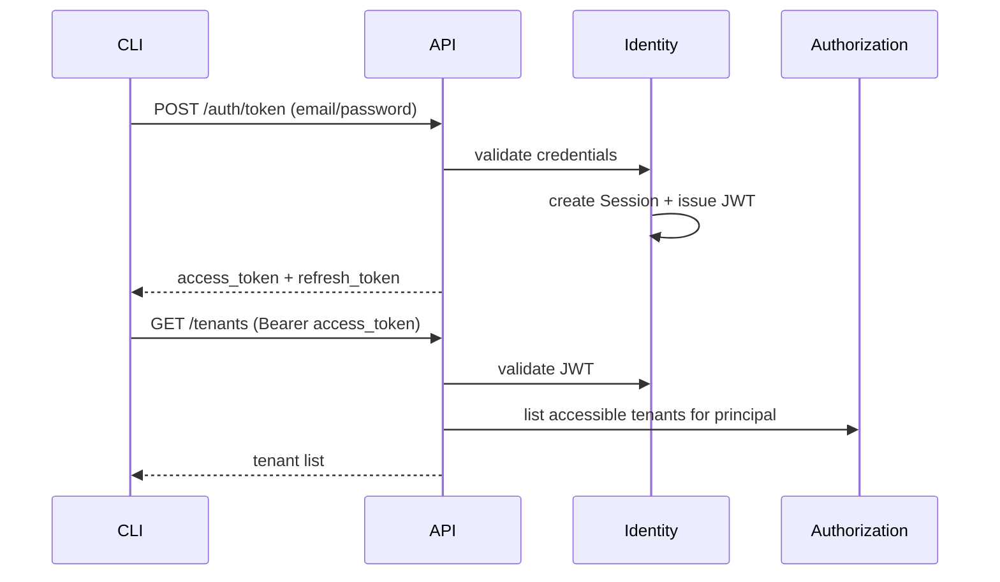

# Workflow: Authentication (Phase 1)

## Business goal

Establish a secure, auditable way for:

- Humans to authenticate (User)
- Automation to authenticate (ServiceAccount via API key)

so that all downstream requests can be authorized and tenant-scoped.

## Authentication modes

- **User login**: username/password (Phase 1), optional SSO later.
- **Service account**: API key header (Phase 1).

## Sequence: user login + tenant list

## Token and context design

- **JWT claims (minimal)**:
  - `sub`: principal id
  - `typ`: `user|service_account`
  - `sid`: session id (for users)
  - `exp`: expiry
- **Do not embed** full RBAC roles/permissions into JWT for Phase 1; role changes should be effective immediately.
- Tenant scoping uses request headers:
  - `X-Tenant-Id` required for most tenant-scoped operations
  - `X-Project-Id` when needed
  - `X-Correlation-Id` for tracing

## Security controls (Phase 1)

- Password hashing (Argon2/bcrypt), rate limiting, lockouts.
- API keys stored hashed at rest, displayed once on creation.
- Session revocation for refresh tokens (access tokens short-lived).
- Audit all login events, key creation/rotation/revocation, and session revocations.

