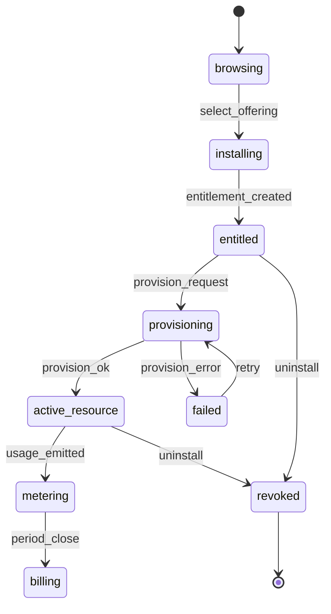

# Workflow: Marketplace tenant lifecycle

Consumer journey from **browse** through **install**, **provision**, **meter**, and **bill**.

## Preconditions

- User authenticated; member of tenant.
- Tenant `status = active`.
- Offering `published` with valid `plan_id` and meters.

## Lifecycle

## Step 1 — Browse catalog

- `GET /v1/marketplace/offerings` — filter by capability, vendor.
- Read model includes product name, plan summary, meter labels.

**Authorization:** any tenant member with `marketplace.read`.

## Step 2 — Install (entitlement)

1. Validate offering published and plugin version active.
2. Create `Entitlement` (`tenant_id`, `offering_id`, `status = active`).
3. Billing: create `Subscription` linked to offering's `plan_id`.
4. Audit: `entitlement.installed`.

**Authorization:** `tenant.marketplace.install`.

## Step 3 — Provision

1. Create `ProvisioningRequest` (idempotency key).
2. Resolve adapter from `AdapterRegistry`.
3. Invoke adapter `provision` with tenant-scoped inputs.
4. On success: create/update `Resource`; mark request `succeeded`.
5. Metering: emit usage events (operation meters).

**Authorization:** `tenant.marketplace.provision`.

## Step 4 — Ongoing metering

| Meter type | Mechanism |
|------------|-----------|
| Time-based | Platform scheduler while entitlement `active` |
| Resource instance | Rollup from resource lifecycle |
| Usage | Adapter/platform ingestion |

Events are append-only; duplicates rejected via `idempotency_key`.

## Step 5 — Billing period

1. At `current_period_end`, Billing aggregates usage for offering meters.
2. Apply plan included units; compute overage.
3. Expose `GET /v1/tenants/{tid}/billing/invoice-preview` (no payment capture in Phase C).

## Uninstall / revoke

1. Deprovision via adapter if resource exists.
2. `Entitlement.status = revoked`; `Subscription.status = revoked`.
3. Stop time-based meter scheduler for entitlement.

## Error handling

| Failure | Behavior |
|---------|----------|
| Quota exceeded | 409 before provision |
| Adapter timeout | ProvisioningRequest `failed`, retry allowed |
| Payment past_due (future) | Block new provisions; existing may degrade per policy |

## Related

- [resource-allocation.md](resource-allocation.md) — platform resources (non-marketplace)
- [billing-domain.md](../domains/billing-domain.md)
- [metering-domain.md](../domains/metering-domain.md)
