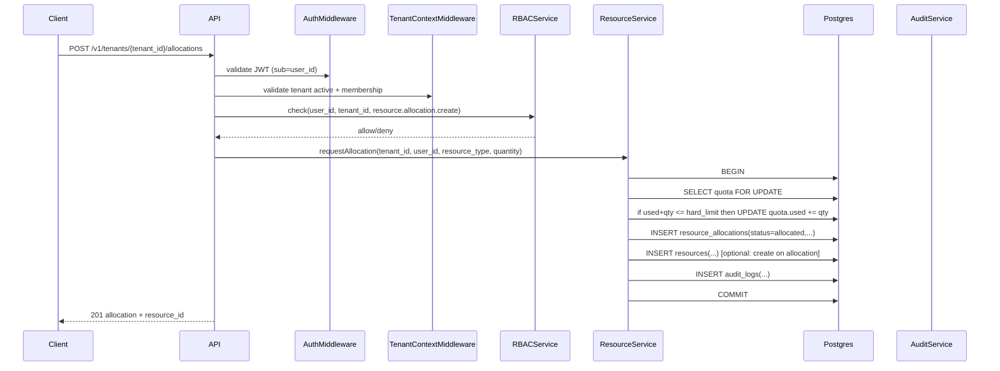
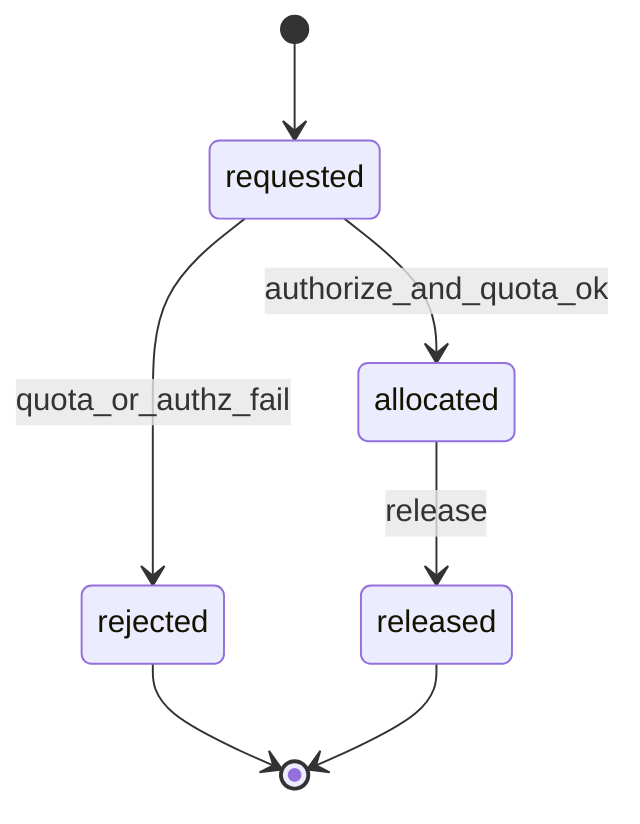

# Phase 2 workflow: Resource allocation (minimal foundation)

This workflow is the minimal end-to-end path required to start implementation:

**User → authorization check → quota check → allocation → audit log**

Non-goals:

- Kubernetes provisioning
- async orchestration/event bus
- marketplace entitlement checks
- billing metering

## Actors and responsibilities

| Component | Responsibility |
|----------|----------------|
| Identity | authenticate user (JWT) |
| Tenant | validate tenant exists and is active; validate user membership |
| Authorization (RBAC) | check permission for action in tenant scope |
| Resource | enforce quota and create allocation + resource record |
| Audit | append audit entry tied to the action |

## Preconditions

| Precondition | Enforced by | Notes |
|-------------|-------------|------|
| User is authenticated | auth middleware | JWT `sub` maps to user |
| Tenant exists and is `active` | tenant context middleware | tenant scoped route param |
| User has active membership in tenant | tenant context middleware | membership is separate from RBAC |
| User has `resource.allocation.create` | handler/service | RBAC check |
| Quota exists (or default) for resource type | resource service | define a default policy for missing quota |

## Sequence diagram (Phase 2 minimal)

## Transaction boundaries (important)

### Why quota needs locking

Quota enforcement is correctness-critical. Without locking, concurrent allocation requests can oversubscribe.

### Minimal safe approach (Phase 2)

All of the following must happen in **one transaction**:

- Lock quota row for `(tenant_id, resource_type)`
- Check capacity
- Increment `quota.used`
- Create `resource_allocations`
- Create audit log entry

Suggested SQL pattern (conceptual):

- `SELECT ... FOR UPDATE` on the quota row
- Then update counters and insert rows

## State machine (minimal)

Phase 2 can start with the smallest useful lifecycle:

If approval is required later, extend with `pending_approval` and `approved`.

## Audit logging requirements (allocation)

Create audit entries for:

| Action | When | Fields to capture |
|--------|------|-------------------|
| `resource.allocation.create` | allocation created | `tenant_id`, `actor_user_id`, `resource_type`, `quantity`, `allocation_id` |
| `resource.create` (optional) | resource row created | `resource_id`, `resource_type`, `name` |
| `resource.allocation.release` | release | `allocation_id`, `resource_id?` |

Audit logging should include:

- `correlation_id` (request header or generated)
- request metadata (`ip`, `user_agent`) when available

## Failure modes (minimal handling)

| Failure | Expected behavior |
|---------|-------------------|
| RBAC denies | 403 + audit (rate-limited) |
| Not a member of tenant | 403 |
| Tenant suspended/deleted | 409 or 403 depending on policy |
| Quota missing | either treat as 0 (deny) or auto-provision default quota (choose one) |
| Quota exceeded | 409/422 + audit |
| DB constraint violation | 409 (idempotency later) |

