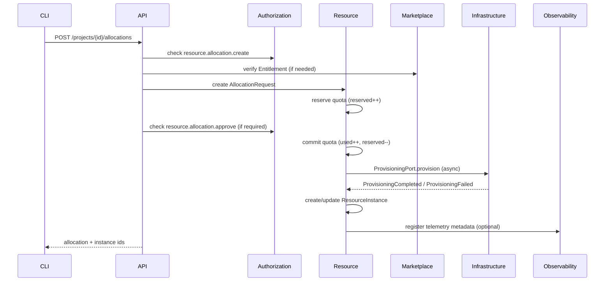
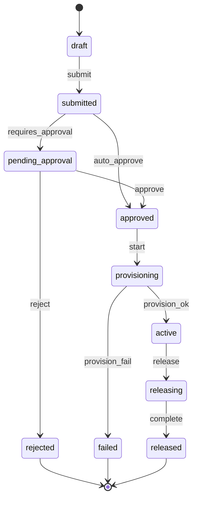

# Workflow: Resource allocation (Phase 1)

## Business goal

Allow a tenant/project to request resources while enforcing:

- Authorization (who can request/approve)
- Entitlements (if resource type is marketplace-gated)
- Quotas (hard limits + reservation semantics)
- Auditability (every state transition is recorded)
- Provisioning integration (asynchronous fulfillment via infrastructure port)

## Preconditions

- Caller is authenticated (User or ServiceAccount).
- Tenant and Project exist and are `active`.
- Caller has required permissions at project/tenant scope.
- For marketplace resource types: tenant has an active entitlement.

## Sequence (high-level)

## State machine (AllocationRequest)

## Domain responsibilities

- **Authorization**:
  - `resource.allocation.create` at project scope
  - `resource.allocation.approve` if approval is required (policy-driven)
- **Marketplace**:
  - entitlement check for gated offerings
- **Resource**:
  - quota reservation and commit semantics
  - allocation request lifecycle + resource instance registry
  - emits events for provisioning and billing usage
- **Infrastructure**:
  - fulfills provisioning request (Phase 1: stub adapter; Phase 2: Kubernetes integration)
- **Observability**:
  - tenant/project metadata for correlation (Phase 1: configuration only)

## Key invariants and failure modes

- **Quota exceeded**: reject at reservation step; emit audit event and return error (Problem Details).
- **Provisioning failure**:
  - mark allocation `failed`
  - consider rolling back quota commit or using a compensating “release” event (choose one policy and audit it)
- **Idempotency**:
  - `X-Idempotency-Key` required for allocation POST.
  - repeat requests return same AllocationRequest/ResourceInstance outcome.

